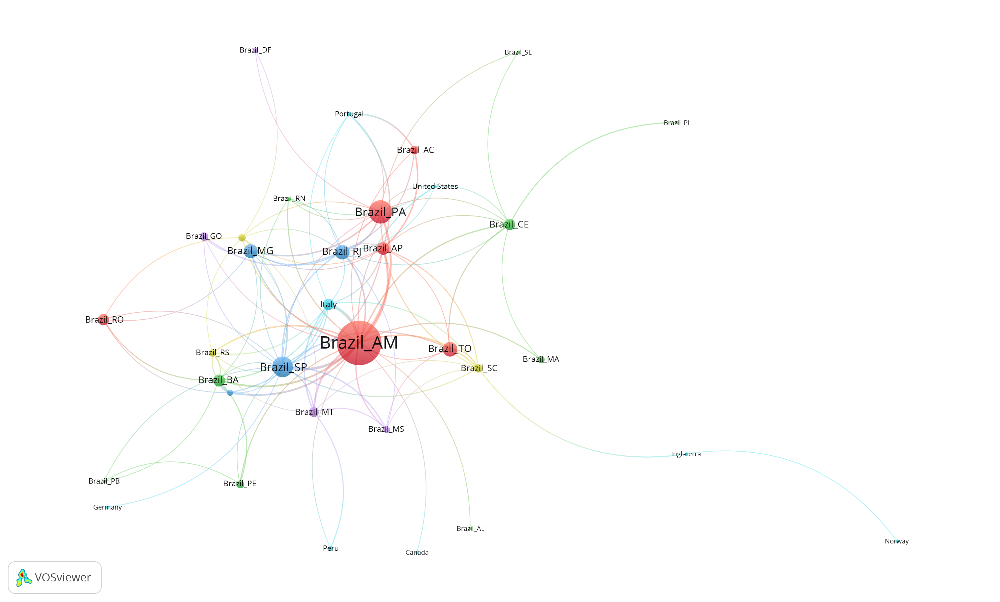
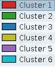

# Lattes Geral {#lattes}

Argumento que apenas parte da ciência esta contida no Scopus ou Web of Science, como destacado por:

* @beigel2014
* @beigel2018
* @mugnaini2019

Beigel apresenta 4 circuitos de divulgação científica, nosso trabalho pode estar em:

* (c) regional Southern circuits; e ou 
* (d) national circuits based on local publications

@mugnaini2019 apresenta quando do Lattes esta indexado no WoS ou Scopus. Importante argumento para ajudar a vender a ideia de utilizar o Lattes.

@rodrigues2015 indicam que apenas 314 periódicos científicos brasileiros estavam indexados nas bases Scopus ou WoS em 2015.

@nascimento2021 analisou a taxa de crescimento das ciência brasileira.

@Albanna2021 Publication outperformance among global South researchers.

## Grandes números

| Documento                | Quantidade |
|--------------------------|------------|
| artigos                  | 497        |
| livros                   | 35         |
| capítulos de livros      | 87         |
| projetos                 | 568        |
| monografias              | 165        |
| dissertações de mestrado | 115        |
| teses de doutorado       | 62         |


## Artigos do Lattes por Estado

Artigos com dois ou mais autores do mesmo estados foram normalizados, apenas um autor conta para cada estado.

```{r eval = T, echo = F}

rio::import('rawfiles/endereco3.rds') ->
    endereco3

rio::import('rawfiles/artigos.rds') |>
    tibble::tibble() ->
    artigos

artigos |>
    dplyr::left_join(endereco3) |>
    dplyr::group_by(titulo_do_artigo, uf2) |>
    dplyr::distinct(.keep_all = T) |>
    dplyr::ungroup() |>
    dplyr::count(uf2, sort = T) |>
    datatable(
        extensions = 'Buttons', 
        rownames = F, 
        options = list(
                    dom = 'Bfrtip', 
                    pageLength = 10, 
                    buttons = list(list(
                                        extend = 'collection', 
                                        buttons = list(list(extend = 'csv', filename = 'data'), 
                                                        list(extend = 'excel', filename = 'data')), 
                                                        text = 'Download'))))


```

Lista de artigos. 

```{r eval = T, echo = F}

artigos |> 
    dplyr::select(- id, - doi) |>
    dplyr::distinct(titulo_do_artigo, .keep_all = T) |>
    datatable(
        extensions = 'Buttons', 
        rownames = F, 
        options = list(
                    dom = 'Bfrtip', 
                    pageLength = 5, 
                    buttons = list(list(
                                        extend = 'collection', 
                                        buttons = list(list(extend = 'csv', filename = 'data'), 
                                                        list(extend = 'excel', filename = 'data')), 
                                                        text = 'Download'))))


``` 

## Livros do Lattes 

```{r eval = T, echo = F}

rio::import('rawfiles/livros.rds') |>
    dplyr::mutate(uf2 = '') ->
    livros

# rio::export(livros, 'rawfiles/livros.xlsx')

livros |>
    dplyr::select(- uf2) |> 
    dplyr::left_join(endereco3) |>
    dplyr::filter(!is.na(uf2)) |> 
    dplyr::group_by(titulo_do_livro, uf2) |>
    dplyr::distinct(.keep_all = T) |>
    dplyr::ungroup() |>
    dplyr::count(uf2, sort = T) |>
    datatable(
        extensions = 'Buttons', 
        rownames = F, 
        options = list(
                    dom = 'Bfrtip', 
                    pageLength = 10, 
                    buttons = list(list(
                                        extend = 'collection', 
                                        buttons = list(list(extend = 'csv', filename = 'data'), 
                                                        list(extend = 'excel', filename = 'data')), 
                                                        text = 'Download'))))

```

Lista de livros.


```{r eval = T, echo = F}

livros |> 
    dplyr::select(titulo_do_livro, ano, isbn) |>
    dplyr::distinct(titulo_do_livro, .keep_all = T) |>
    datatable(
        extensions = 'Buttons', 
        rownames = F, 
        options = list(
                    dom = 'Bfrtip', 
                    pageLength = 5, 
                    buttons = list(list(
                                        extend = 'collection', 
                                        buttons = list(list(extend = 'csv', filename = 'data'), 
                                                        list(extend = 'excel', filename = 'data')), 
                                                        text = 'Download'))))


``` 

## Capítulos de Livros do Lattes 

```{r eval = T, echo = F}

rio::import('rawfiles/capitulos_livros.rds') |>
    tibble::tibble() ->
    capitulos_livros

capitulos_livros |>
    dplyr::left_join(endereco3) |>
    dplyr::filter(!is.na(uf2)) |> 
    dplyr::group_by(titulo_do_capitulo_do_livro, uf2) |>
    dplyr::distinct(.keep_all = T) |>
    dplyr::ungroup() |>
    dplyr::count(uf2, sort = T) |>
    datatable(
        extensions = 'Buttons', 
        rownames = F, 
        options = list(
                    dom = 'Bfrtip', 
                    pageLength = 10, 
                    buttons = list(list(
                                        extend='collection', 
                                        buttons = list( list(extend = 'csv', filename = 'data'), 
                                                        list(extend = 'excel', filename = 'data')), 
                                                        text='Download'))))

```

List de capítulos de livros.

```{r eval = T, echo = F}

capitulos_livros |> 
    dplyr::select(titulo_do_capitulo_do_livro, ano, isbn) |>
    dplyr::distinct(titulo_do_capitulo_do_livro, .keep_all = T) |>
    datatable(
        extensions = 'Buttons', 
        rownames = F, 
        options = list(
                    dom = 'Bfrtip', 
                    pageLength = 5, 
                    buttons = list(list(
                                        extend = 'collection', 
                                        buttons = list(list(extend = 'csv', filename = 'data'), 
                                                        list(extend = 'excel', filename = 'data')), 
                                                        text = 'Download'))))


``` 


## Projetos do Lattes 

```{r eval = T, echo = F}

rio::import('rawfiles/projetos.rds') |>
    tibble::tibble() ->
    projetos

projetos |>
    dplyr::left_join(endereco3) |>
    dplyr::filter(!is.na(uf2)) |> 
    dplyr::group_by(nome_do_projeto, uf2) |>
    dplyr::distinct(.keep_all = T) |>
    dplyr::ungroup() |>
    dplyr::count(uf2, sort = T) |>
    datatable(
        extensions = 'Buttons', 
        rownames = F, 
        options = list(
                    dom = 'Bfrtip', 
                    pageLength = 10, 
                    buttons = list(list(
                                        extend='collection', 
                                        buttons = list( list(extend = 'csv', filename = 'data'), 
                                                        list(extend = 'excel', filename = 'data')), 
                                                        text='Download'))))

```

Lista de projetos. 

```{r eval = T, echo = F}

projetos |> 
    dplyr::select(nome_do_projeto, ano_inicio, ano_fim) |>
    dplyr::distinct(nome_do_projeto, .keep_all = T) |>
    datatable(
        extensions = 'Buttons', 
        rownames = F, 
        options = list(
                    dom = 'Bfrtip', 
                    pageLength = 5, 
                    buttons = list(list(
                                        extend = 'collection', 
                                        buttons = list(list(extend = 'csv', filename = 'data'), 
                                                        list(extend = 'excel', filename = 'data')), 
                                                        text = 'Download'))))


``` 

## Monografias do Lattes 

Nome do curso.

```{r eval = T, echo = F}

rio::import('rawfiles/formacao_graduacao.rds') |>
    tibble::tibble() ->
    monografias

monografias |>
   dplyr::count(nome_curso, sort = T) |>
    datatable(
        extensions = 'Buttons', 
        rownames = F, 
        options = list(
                    dom = 'Bfrtip', 
                    pageLength = 10, 
                    buttons = list(list(
                                        extend='collection', 
                                        buttons = list( list(extend = 'csv', filename = 'data'), 
                                                        list(extend = 'excel', filename = 'data')), 
                                                        text='Download'))))

```

Universidade.

```{r eval = T, echo = F}

monografias |>
   dplyr::count(nome_instituicao, sort = T) |>
    datatable(
        extensions = 'Buttons', 
        rownames = F, 
        options = list(
                    dom = 'Bfrtip', 
                    pageLength = 10, 
                    buttons = list(list(
                                        extend='collection', 
                                        buttons = list( list(extend = 'csv', filename = 'data'), 
                                                        list(extend = 'excel', filename = 'data')), 
                                                        text='Download'))))

```

Estado.


```{r eval = T, echo = F}

monografias |>
    dplyr::select(id, nome_instituicao) |>
    dplyr::filter(id != '') |>
    dplyr::mutate(nome_instituicao = stringr::str_trim(stringi::stri_trans_general(tolower(nome_instituicao), "Latin-ASCII"))) |>
    dplyr::left_join(endereco3 |> dplyr::select(- id) |> dplyr::distinct(.keep_all = T)) ->
    monografias_uf

monografias_uf |>
    dplyr::filter(is.na(uf2)) |>
    {\(acima) rio::export(acima, 'rawfiles/monografia_nouf.xlsx')}()

rio::import('rawfiles/monografia_nouf_v2.xlsx') |>
    tibble::as_tibble() |>
    dplyr::filter(!is.na(uf2)) |>
    dplyr::bind_rows(monografias_uf) |>
    dplyr::group_by(id, nome_instituicao) |>
    dplyr::distinct(.keep_all = TRUE) |>
    dplyr::ungroup() |>
    dplyr::count(uf2, sort = T) |>
    dplyr::filter(!is.na(uf2)) |> 
    datatable(
        extensions = 'Buttons', 
        rownames = F, 
        options = list(
                    dom = 'Bfrtip', 
                    pageLength = 10, 
                    buttons = list(list(
                                        extend='collection', 
                                        buttons = list( list(extend = 'csv', filename = 'data'), 
                                                        list(extend = 'excel', filename = 'data')), 
                                                        text='Download'))))

```


## Dissertações do Lattes 

Nome do curso.

```{r eval = T, echo = F}

rio::import('rawfiles/formacao_mestrado.rds') |>
    tibble::tibble() ->
    mestrado

mestrado |>
    dplyr::count(nome_curso, sort = T) |> 
    datatable(
        extensions = 'Buttons', 
        rownames = F, 
        options = list(
                    dom = 'Bfrtip', 
                    pageLength = 5, 
                    buttons = list(list(
                                        extend='collection', 
                                        buttons = list( list(extend = 'csv', filename = 'data'), 
                                                        list(extend = 'excel', filename = 'data')), 
                                                        text='Download'))))

```

Universidade.

```{r eval = T, echo = F}

mestrado |>
   dplyr::count(nome_instituicao, sort = T) |>
    datatable(
        extensions = 'Buttons', 
        rownames = F, 
        options = list(
                    dom = 'Bfrtip', 
                    pageLength = 10, 
                    buttons = list(list(
                                        extend='collection', 
                                        buttons = list( list(extend = 'csv', filename = 'data'), 
                                                        list(extend = 'excel', filename = 'data')), 
                                                        text='Download'))))

```

Estado.


```{r eval = T, echo = F}

mestrado |>
    dplyr::select(id, nome_instituicao) |>
    dplyr::filter(id != '') |>
    dplyr::mutate(nome_instituicao = stringr::str_trim(stringi::stri_trans_general(tolower(nome_instituicao), "Latin-ASCII"))) |>
    dplyr::left_join(endereco3 |> dplyr::select(- id) |> dplyr::distinct(.keep_all = T)) ->
    mestrado_uf

mestrado_uf |>
    dplyr::filter(is.na(uf2)) |>
    {\(acima) rio::export(acima, 'rawfiles/mestrado_nouf.xlsx')}()

rio::import('rawfiles/mestrado_nouf_v2.xlsx') |>
    tibble::as_tibble() |>
    dplyr::filter(!is.na(uf2)) |>
    dplyr::bind_rows(mestrado_uf) |>
    dplyr::group_by(id, nome_instituicao) |>
    dplyr::distinct(.keep_all = TRUE) |>
    dplyr::ungroup() |>
    dplyr::count(uf2, sort = T) |>
    dplyr::filter(!is.na(uf2)) |> 
    datatable(
        extensions = 'Buttons', 
        rownames = F, 
        options = list(
                    dom = 'Bfrtip', 
                    pageLength = 10, 
                    buttons = list(list(
                                        extend='collection', 
                                        buttons = list( list(extend = 'csv', filename = 'data'), 
                                                        list(extend = 'excel', filename = 'data')), 
                                                        text='Download'))))

```

## Teses do Lattes 

```{r eval = T, echo = F}

rio::import('rawfiles/formacao_doutorado.rds') |>
    tibble::tibble() ->
    doutorado

doutorado |>
    dplyr::count(nome_curso, sort = T) |>
        datatable(
        extensions = 'Buttons', 
        rownames = F, 
        options = list(
                    dom = 'Bfrtip', 
                    pageLength = 5, 
                    buttons = list(list(
                                        extend='collection', 
                                        buttons = list( list(extend = 'csv', filename = 'data'), 
                                                        list(extend = 'excel', filename = 'data')), 
                                                        text='Download'))))

```

Universidade.

```{r eval = T, echo = F}

doutorado |>
   dplyr::count(nome_instituicao, sort = T) |>
    datatable(
        extensions = 'Buttons', 
        rownames = F, 
        options = list(
                    dom = 'Bfrtip', 
                    pageLength = 10, 
                    buttons = list(list(
                                        extend='collection', 
                                        buttons = list( list(extend = 'csv', filename = 'data'), 
                                                        list(extend = 'excel', filename = 'data')), 
                                                        text='Download'))))

```

Estado.

```{r eval = T, echo = F}

doutorado |>
    dplyr::select(id, nome_instituicao) |>
    dplyr::filter(id != '') |>
    dplyr::mutate(nome_instituicao = stringr::str_trim(stringi::stri_trans_general(tolower(nome_instituicao), "Latin-ASCII"))) |>
    dplyr::left_join(endereco3 |> dplyr::select(- id) |> dplyr::distinct(.keep_all = T)) ->
    doutorado_uf

doutorado_uf |>
    dplyr::filter(is.na(uf2)) |>
    {\(acima) rio::export(acima, 'rawfiles/doutorado_nouf.xlsx')}()

rio::import('rawfiles/doutorado_nouf_v2.xlsx') |>
    tibble::as_tibble() |>
    dplyr::filter(!is.na(uf2)) |>
    dplyr::bind_rows(doutorado_uf) |>
    dplyr::group_by(id, nome_instituicao) |>
    dplyr::distinct(.keep_all = TRUE) |>
    dplyr::ungroup() |>
    dplyr::count(uf2, sort = T) |>
    dplyr::filter(!is.na(uf2)) |> 
    datatable(
        extensions = 'Buttons', 
        rownames = F, 
        options = list(
                    dom = 'Bfrtip', 
                    pageLength = 10, 
                    buttons = list(list(
                                        extend='collection', 
                                        buttons = list( list(extend = 'csv', filename = 'data'), 
                                                        list(extend = 'excel', filename = 'data')), 
                                                        text='Download'))))

```

## Artigos - rede colaboração entre estados 

```{r eval = T, echo = F}

artigos |>
    dplyr::left_join(endereco3) |>
    dplyr::arrange(titulo_do_artigo) |> 
    dplyr::filter(!is.na(uf2)) |>
    dplyr::group_by(titulo_do_artigo, uf2) |>
    dplyr::distinct(.keep_all = T) |>
    dplyr::ungroup() ->
    artigos3

# add primary key by article: que se repete quando o artigo tem mais de 1 autor
artigos3 |> 
    dplyr::group_by(titulo_do_artigo) |> 
    dplyr::group_indices(titulo_do_artigo) ->  
    artigos3$pmk 

artigos3 |> 
    dplyr::arrange(pmk) -> 
    artigos3

# artigos3 |>
#     dplyr::mutate(PY = as.numeric(ano_do_artigo)) |>
#     dplyr::count(PY, sort = F) |>
#     print(n = Inf)

# gerando edges
artigos3 |> dplyr::select(pmk, uf2) |>  dplyr::arrange(pmk) -> temp
temp2 <- split(temp, f = temp$pmk)
temp2 <- lapply(temp2, function(x) {as.character(x$uf2)})
idv <- temp2
temp2 <- lapply(temp2, function(x) {expand.grid.unique(x, x, include.equals = F)})

temp2 %>>%
    dplyr::bind_rows() %>>%
    (aggregate(list(weight = rep(1, nrow(.))), ., length)) %>>%
    (dplyr::arrange(., - weight)) %>>%
    (tibble::as_tibble(.) -> ide)

# gerando vertices
idv <- unlist(idv) 
idv2 <- idv[!duplicated(idv)]
names(idv2) <- NULL

artigos3 %>>% 
    dplyr::count(uf2, name = 'qtde_artigos') %>>% 
    dplyr::rename(name = uf2) %>>% 
    (. -> aa)

graph.data.frame(ide, directed = FALSE, vertices = idv2) %>>%
    (as_tbl_graph(.) -> net)

net %>>%
    activate(nodes) %>>%
    left_join(aa) %>>%
    tidygraph::activate(nodes) %>>%
    dplyr::filter(!is.na(qtde_artigos)) %>>%
    dplyr::filter(name != 'Brasil') %>>%
    dplyr::mutate(id = name) %>>% 
    (. -> net)

V(net)$estado <- gsub('Brasil_', '', (V(net)$name))

import('rawfiles/sigla_estados.csv') |>
    tibble::as_tibble() |>
    dplyr::mutate(regiao_id = str_sub(co_uf, 1, 1)) |>
    dplyr::select(estado = sigla_uf, regiao, regiao_id) ->
    bb

net %>>%
    activate(nodes) |>
    left_join(bb) |>
    dplyr::mutate(regiao = ifelse(is.na(regiao), 'Exterior', regiao)) |>
    dplyr::mutate(regiao_id = ifelse(is.na(regiao_id), 6, regiao_id)) ->
    net

# exportar para o vosviewer 
write_graph(net, file = 'networks/netocuf.net', format = c("pajek"))
writePajek(V(net)$qtde_artigos, 'networks/netocuf_qtde.vec')
writePajek(V(net)$regiao_id, 'networks/netocuf_regiao.clu')
```

VosViewer - Fractionalization - Attraction 6 Repulsion 1

Cores dos nós por região do Brasil, ou país estrangeiro. Tamanho do nó por quantidade de artigos por região. 


[png file](networks/netocuf.png)


## Artigos - rede colaboração entre autores

```{r eval = T, echo = F}

artigos |>
    dplyr::left_join(endereco3) |>
    dplyr::arrange(titulo_do_artigo) |> 
    dplyr::filter(!is.na(uf2)) |>
    dplyr::group_by(titulo_do_artigo, uf2) |>
    dplyr::distinct(.keep_all = T) |>
    dplyr::ungroup() ->
    artigos3

# add primary key by article: que se repete quando o artigo tem mais de 1 autor
artigos3 |> 
    dplyr::group_by(titulo_do_artigo) |> 
    dplyr::group_indices(titulo_do_artigo) ->  
    artigos3$pmk 

artigos3 |> 
    dplyr::arrange(pmk) -> 
    artigos3

# gerando edges
artigos3 |> dplyr::select(pmk, id) |>  dplyr::arrange(pmk) -> temp
temp2 <- split(temp, f = temp$pmk)
temp2 <- lapply(temp2, function(x) {as.character(x$id)})
idv <- temp2
temp2 <- lapply(temp2, function(x) {expand.grid.unique(x, x, include.equals = F)})

temp2 %>>%
    bind_rows() %>>%
    (aggregate(list(weight = rep(1, nrow(.))), ., length)) %>>%
    (arrange(., - weight)) %>>%
    (as_tibble(.) -> ide)

# gerando vertices
idv <- unlist(idv) 
idv2 <- idv[!duplicated(idv)]
names(idv2) <- NULL

artigos3 %>>% 
    count(id, name = 'qtde_artigos') %>>% 
    rename(name = id) %>>% 
    (. -> aa)

graph.data.frame(ide, directed = FALSE, vertices = idv2) %>>%
    (as_tbl_graph(.) -> net)

# nome curto
rio::import('rawfiles/dados_gerais.rds') |> 
    dplyr::select(name = id, citar_como = nome_em_citacoes_bibliograficas, nome_completo) |>
    dplyr::mutate(citar_como = gsub(';.*$', '', citar_como)) ->
    citar_como

net %>>%
    activate(nodes) %>>%
    dplyr::left_join(aa) %>>%
    tidygraph::activate(nodes) %>>%
    dplyr::filter(!is.na(qtde_artigos)) %>>%
    dplyr::left_join(citar_como) %>>%
    dplyr::left_join(endereco3 |> dplyr::select(name = id, uf2)) %>>%
    dplyr::rename(id = citar_como) %>>%
    (. -> net)

net %>>%
    activate(nodes) |>
    dplyr::mutate(estado = gsub('Brasil_', '', uf2)) |> 
    left_join(bb) |>
    dplyr::mutate(regiao = ifelse(is.na(regiao), 'Exterior', regiao)) |>
    dplyr::mutate(regiao_id = ifelse(is.na(regiao_id), 6, regiao_id)) ->
    net

net |>
    activate(nodes) |>
    dplyr::filter(qtde_artigos > 3) ->
    net

# exportar para o vosviewer 
# write_graph(net, file = 'networks/netcolaut.net', format = c("pajek")) # sobrenomes normalizados na mão
writePajek(V(net)$qtde_artigos, 'networks/netcolaut_qtde.vec')
writePajek(V(net)$regiao_id, 'networks/netcolaut_regiao.clu')
```

VosViewer - Association Strength - Attraction 6 Repulsion 0

Autores com 5 ou mais artigos.


[png file](networks/netcolaut.png)

Cores das regiões


[png file](networks/cores_grupos_regioes.png)

* Cluster 1 = Norte
* Cluster 2 = Nordeste
* Cluster 3 = Sudeste
* Cluster 4 = Sul
* Cluster 5 = Centro-Oeste
* Cluster 6 = Exterior

## Pricipais autores do Lattes

Os endereços foram obtivos via cadastro do endereço profissional do Lattes, ou do local da tese, mestrado e monografia, seguindo esta ordem.

É útil conferir os endereços dos principais autores.

```{r eval = T, echo = F}

net |>
    activate(nodes) |>
    tibble::as_tibble() |>
    dplyr::arrange(dplyr::desc(qtde_artigos)) |>
    dplyr::mutate(id, link = paste0('http://lattes.cnpq.br/', name)) |>
    dplyr::select(nome_completo, qtde_artigos, uf2, link) |>
    datatable(
        extensions = 'Buttons', 
        rownames = F, 
        options = list(
                    dom = 'Bfrtip', 
                    pageLength = 10, 
                    buttons = list(list(
                                        extend='collection', 
                                        buttons = list( list(extend = 'csv', filename = 'data'), 
                                                        list(extend = 'excel', filename = 'data')), 
                                                        text='Download'))))

```


