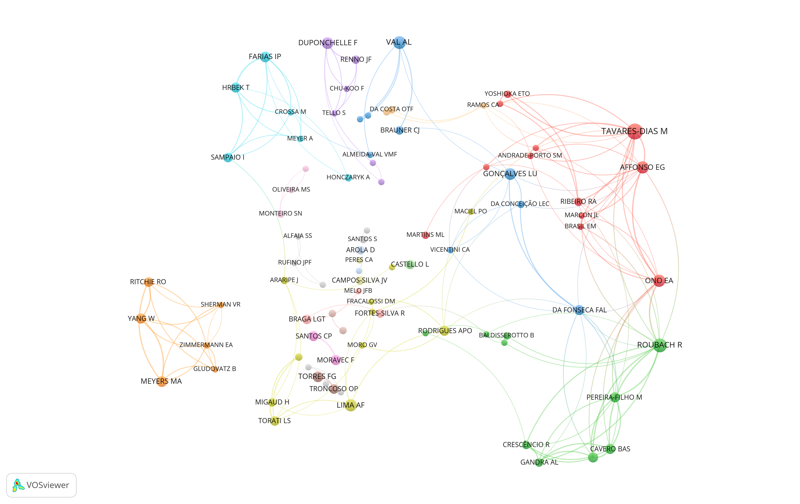

# Scopus  

Since the amount of documents returned was the same for Scopus and WoS, 358 publications, I chose to work with Scopus. Scopus allows greater control of author addresses via the `API rscopus`.

Query

```

358 document results
( TITLE-ABS-KEY ( pirarucu )  OR  TITLE-ABS-KEY ( "arapaima gigas" )  OR  TITLE-ABS-KEY ( paiche ) )  
```

Search performed on 2022-11-12.

```{r eval = F, echo = T, warning = F, error = T, tidy = F, message = F}

M <- bibliometrix::convert2df(file = 'bibs/scopus_2022-11-12.bib', dbsource = "scopus", format = "bibtex")

rio::export(M, 'rawfiles/m_scopus.rds') 

M |>
  tibble::as_tibble() |>
  dplyr::select(SR_FULL, TI, DI, url) |>
  {\(x) rio::export(x, 'rawfiles/data_supplementary.xlsx') }() 

```

## Countries collaboration netowrk


```{r eval = F, echo = T, warning = FALSE, error = TRUE, tidy = FALSE, message = FALSE}

rio::import('rawfiles/m_scopus.rds') -> M 

# Address Scopus API

# existe API
rscopus::have_api_key()

# ----------
## 
# M[10, ] |> dplyr::pull(TI) 

# Query <- "TITLE ('ASSESSMENT OF SMALLHOLDER FARMERS ADAPTIVE CAPACITY TO CLIMATE CHANGE : USE OF A MIXED WEIGHTING SCHEME')  AND  (LIMIT-TO ( DOCTYPE , 'ar')  OR  LIMIT-TO ( DOCTYPE ,  're' ))"

# rscopus::scopus_search(query = Query, 
#                        view = "COMPLETE", 
#                        count = 200) ->
#     x

# rscopusAffiliation(x)
# rscopusAutInsArt(x)
# rscopusAuthors(x)
# ----------


p1 <- "( TITLE ( '"
p2 <- "' )  OR  DOI ("
p3 <- ") )"

M |> 
    dplyr::select(TI, DI) |>
    dplyr::mutate(query = paste0(p1, TI, p2, DI, p3)) |>
    dplyr::pull(query) ->
    query

my_scopus_search <- function(x) { 
    rscopus::scopus_search(query = x, view = "COMPLETE", count = 200) 
}

query |>
    purrr::map(purrr::safely(my_scopus_search)) |>
    purrr::map(purrr::pluck, 'result') ->
    res_previo

res_previo |>
    purrr::map(purrr::safely(rscopusAffiliation)) |>
    purrr::map(purrr::pluck, 'result') |>
    purrr::map(tibble::as_tibble) ->
    afiliacao

rio::export(afiliacao, 'rawfiles/m_scopus_afilicao.rds')

query |>                                          
    purrr::map(purrr::safely(my_scopus_search)) |>
    purrr::map(purrr::pluck, 'result') ->         
    res

rio::export(res, 'rawfiles/res.rds') 

res |>                                          
    purrr::map(purrr::safely(rscopusSponsor)) |>
    purrr::map(purrr::pluck, 'result') |>         
    dplyr::bind_rows() |>
    dplyr::group_by(fund_sponsor) |>
    dplyr::tally(name = 'qtde', sort = T) |>
    {\(x) rio::export(x, 'rawfiles/scopus_financiadores.xlsx') }() 
```

```{r eval = T, echo = T, warning = FALSE, error = TRUE, tidy = FALSE, message = FALSE}

rio::import('rawfiles/m_scopus.rds') -> 
    M 

rio::import('rawfiles/m_scopus_afilicao.rds') ->
    afiliacao

M$id <- as.character(1:nrow(M))

# ------------
# 
afiliacao |> 
    purrr::map(janitor::clean_names) |>
    dplyr::bind_rows(.id = 'id') |>
    dplyr::group_by(id) |>
    tidyr::nest() |>
    dplyr::rename(affiliation = data) |>
    dplyr::ungroup() |>
    dplyr::right_join(M) ->
    M2

M2 |> 
    dplyr::select(SR, id, affiliation)  |>
    tidyr::unnest_wider(affiliation) |>
    tidyr::unnest_longer(affiliation_country) |>
    dplyr::select(SR, id, affiliation_country) |>
    dplyr::distinct(.keep_all = TRUE) |>
    dplyr::group_by(SR, id) |>
    dplyr::summarise(qtde_paises = dplyr::n()) |>
    dplyr::ungroup() ->
    artigo_qtde_paises

afiliacao |>
    purrr::compact() |>
    purrr::map(~ .x |> janitor::clean_names()) |>
    purrr::map(~ .x |> dplyr::pull(affiliation_country)) |>
    purrr::map(function(x) {expand.grid.unique(x, x, include.equals = F)}) |>
    dplyr::bind_rows() |>
    tibble::as_tibble() ->
    ide

c(ide$V1, ide$V2) |>
    unique() |>
    sort() ->
    idv

ide |>
    dplyr::filter(!is.na(V1)) |>
    dplyr::filter(!is.na(V2)) ->
    ide2

igraph::graph.data.frame(ide2, directed = FALSE, vertices = idv) |>
    {\(x) igraph::graph.adjacency(igraph::get.adjacency(x), weighted = TRUE)}() |>
    {\(x) igraph::simplify(x, remove.multiple = T, edge.attr.comb = list(weight = 'sum'))}() |>
    tidygraph::as_tbl_graph() -> 
    net

M2 |>
    dplyr::select(SR, id, affiliation)  |>
    tidyr::unnest_wider(affiliation) |>
    tidyr::unnest_longer(affiliation_country) |>
    dplyr::select(SR, id, affiliation_country) |>
    dplyr::distinct(.keep_all = TRUE) |>
    dplyr::group_by(affiliation_country) |>
    dplyr::summarise(qtde_artigos = n()) |>
    dplyr::rename(name = affiliation_country) |>
    dplyr::ungroup() ->
    paises_artigos 

net |>
    tidygraph::activate(nodes) |>
    dplyr::left_join(paises_artigos) |>
    dplyr::arrange(desc(qtde_artigos)) ->
    net2

net2 |>
    tidygraph::activate(nodes) |>
    dplyr::mutate(degree = degree(net2),
                  closeness = closeness(net2),
                  betweenness = betweenness(net2)) |>
    tibble::as_tibble() ->
    net2_atributos

# ---------
## sjr 
readr::read_csv2('rawfiles/scimagojr_2019_filtrado.csv') |>
    janitor::clean_names() |>
    dplyr::arrange(desc(sjr)) |>
    tidyr::separate_rows(issn, sep = ',') |>
    dplyr::mutate(issn = stringr::str_trim(issn)) |>
    dplyr::distinct(issn, .keep_all = TRUE) ->
    sjr

M2 |> 
    dplyr::select(SR, SN, id, affiliation)  |>
    tidyr::unnest_wider(affiliation) |>
    tidyr::unnest_longer(affiliation_country) |>
    dplyr::select(SN, id, affiliation_country) |>
    dplyr::rename(issn = SN) |>
    dplyr::distinct(.keep_all = TRUE) |>
    left_join(sjr) |>
    dplyr::mutate(sjr = ifelse(is.na(sjr), 20, sjr)) ->
    m2_sjr

m2_sjr |>
    dplyr::select(id, affiliation_country, sjr) |> 
    dplyr::filter(!is.na(affiliation_country)) |> 
    dplyr::group_by(id, affiliation_country) |>
    dplyr::slice_head(n = 1) |>
    dplyr::ungroup() |>
    dplyr::group_by(affiliation_country) |>
    dplyr::summarise(sjr = sum(sjr)) |>
    dplyr::rename(name = affiliation_country) -> 
    sjr_scopus

net2_atributos |>
    dplyr::full_join(sjr_scopus) |>
    dplyr::mutate(sjr_medio = sjr / qtde_artigos) |>
    dplyr::relocate(name, qtde_artigos, sjr, sjr_medio, degree, closeness, betweenness) ->
    net2_atributos2

rio::export(net2_atributos2, 'rawfiles/m_scopus_col_cou_atributos2.xlsx') 

artigos3 |>
    dplyr::left_join(sjr %>>% dplyr::select(issn, sjr)) |>
    dplyr::mutate(sjr = ifelse(is.na(sjr), 20, sjr)) ->
    artigos4

eb <- igraph::cluster_louvain(as.undirected(net2))

net2 |>
    tidygraph::activate(nodes) |>
    dplyr::mutate(group = eb$membership) ->
    net3

net3 |>
    tidygraph::activate(nodes) |>
    group_by(eb) |>
    slice_head(n = 4) |>
    print(n = Inf)

igraph::V(net2)$id <- igraph::V(net2)$name
igraph::write_graph(net2, file = 'networks/m_scopus_col_cou.net', format = c("pajek"))
writePajek(eb$membership, 'networks/m_scopus_col_cou_cluster.clu')
writePajek(V(net2)$qtde_artigos, 'networks/m_scopus_col_cou.vec')
```

[Countries collaboration network - Scopus.](networks/m_scopus_col_cou.png)


## Growth rate 

Growth rate for documents obtained from Scopus for the period 2000 to 2021.

```{r eval = TRUE, echo = T, warning = FALSE, error = TRUE, tidy = FALSE, message = FALSE}

M <- rio::import('rawfiles/m_scopus.rds')

M %>>%
    count(PY, sort = F, name = 'Papers') %>>%
    (~ d0) %>>%
    dplyr::filter(PY %in% c(2000:2020)) %>>% 
    dplyr::arrange(PY) %>>% 
    dplyr::mutate(trend = 1:n()) %>>% 
    (. -> d)

d$lnp <- log(d$Papers)

m1 <- lm(lnp ~ trend, data = d)
# summary(m1)

beta0 <- m1$coefficients[[1]]
beta1 <- m1$coefficients[[2]]

# 2000 
m2 <- nls(Papers ~ b0 * exp(b1 * (PY - 2000)), start = list(b0 = beta0, b1 = beta1), data = d)
# summary(m2)

d$predicted <- 1.77285 * exp(0.15751 * (d$PY - 2000))

# (exp(0.15751) - 1) * 100
# log(2) / 0.15751

d %>>% 
    mutate(Year = PY) %>>% 
    mutate(predicted = round(predicted, 0)) %>>% 
    (. -> d)

periodo <- 2000:2024
predicted <- tibble::tibble(PY = periodo, Predicted = round(1.77285 * exp(0.15751 * (periodo - 2000)), 0)) 

dplyr::full_join(d0, predicted) |>
    dplyr::rename(Year = PY) |>
    dplyr::filter(Year %in% 2000:2020) ->
    d2

# p <- ggplot2::ggplot(d2, aes(x = Year, y = Papers)) + 
#     ggplot2::geom_line(aes(x = Year, y = Papers, colour = "Papers Scopus")) + 
#     ggplot2::geom_point(aes(y = Papers, color = 'Papers Scopus')) + 
#     ggplot2::geom_line(aes(y = Predicted, color = 'Predicted Scopus'), linetype = 'longdash') + 
#     ggplot2::geom_point(aes(y = Predicted, color = 'Predicted Scopus')) + 
#     scale_x_continuous(name = 'Year', breaks = seq(2000, 2020, by = 2), limits = c(2000, 2020)) +
#     scale_y_continuous(name = 'Papers', breaks = seq(0, 45, by = 5), limits = c(0, 45)) +
#     scale_color_manual(name = "Publications", values = c("Predicted Scopus" = "red", "Papers Scopus" = "black")) +
#     theme_bw() +
#     ylab('Papers') +
#     theme(axis.text.x = element_text(angle = 90, vjust = 0.5, hjust = 1), legend.position = "bottom")

# p + ggplot2::annotate("text", x = 2009, y = 40, size = 3, label = 'Predicted Y_p = 1.77 * e ^ 0.15 (year-2000)', parse = F) 

# ggsave('images/taxa-crescimento-scopus.png', width = 10, height = 10, units = c("cm"))

highcharter::hchart(d2, "column", hcaes(x = Year, y = Papers), name = "Publications", showInLegend = TRUE) %>>%
   highcharter::hc_add_series(d2, "line", hcaes(x = Year, y = Predicted), name = "Predicted", showInLegend = TRUE) %>>% 
   highcharter::hc_add_theme(hc_theme_google()) %>>%
   highcharter::hc_navigator(enabled = TRUE)  %>>% 
   highcharter::hc_exporting(enabled = TRUE, filename = 'groups_growth') %>>%
   highcharter::hc_xAxis(plotBands = list(list(from = 2021, to = 2021, color = "#330000")))
```

Analysis 2000-2021
<ul>
  <li> Growth Rate 17.05% </li>
  <li> Doubling time  4.4 Years </li>
</ul>

__Growth rate of the entire Scopus.__

```{r eval = TRUE, echo = T, warning = FALSE, error = TRUE, tidy = FALSE, message = FALSE}

d0 <- read.table('rawfiles/Scopus-38425968-Analyze-Year.csv', header = T, sep = ',', skip = 3) 

d0 |>
    dplyr::mutate(Papers = Papers / 100000) |> 
    dplyr::filter(PY %in% c(2000:2021)) %>>% 
    dplyr::arrange(PY) %>>% 
    dplyr::mutate(trend = 1:n()) %>>% 
    (. -> d)

d$lnp <- log(d$Papers)

m1 <- lm(lnp ~ trend, data = d)
# summary(m1)

beta0 <- m1$coefficients[[1]]
beta1 <- m1$coefficients[[2]]

# 2000 
m2 <- nls(Papers ~ b0 * exp(b1 * (PY - 2000)), start = list(b0 = beta0, b1 = beta1), data = d)
# summary(m2)

d$predicted <- 1.26206 * exp(0.169719 * (d$PY - 1990))

# (exp(0.052582) - 1) * 100
# log(2) / 0.052582
```

Analysis 2000-2021
<ul>
  <li> Growth Rate 5.5% </li>
  <li> Doubling time  13 Years </li>
</ul>

## Top Journals

```{r eval = T , echo = T}

results <- bibliometrix::biblioAnalysis(M, sep = ";")

S <- summary(object = results, k = 10, pause = F, verbose = F)

S$MostRelSources |>
        datatable(
            extensions = 'Buttons', 
            rownames = F, 
            options = list(
                        dom = 'Bfrtip', 
                        pageLength = 10, 
                        buttons = list(list(
                                            extend = 'collection', 
                                            buttons = list(list(extend = 'csv', filename = 'data'), 
                                                            list(extend = 'excel', filename = 'data')), 
                                                            text = 'Download'))))  
```

## Most cited papers

```{r eval = T , echo = T}

M |>
    tibble::as_tibble() |>
    dplyr::select(SR, AU, PY, TI, DI, TC, DE, AB, SO) |>
    {\(x) rio::export(x, 'rawfiles/m_scopus_resumo.xlsx') }() 

S$MostCitedPapers |>
        datatable(
            extensions = 'Buttons', 
            rownames = F, 
            options = list(
                        dom = 'Bfrtip', 
                        pageLength = 10, 
                        buttons = list(list(
                                            extend = 'collection', 
                                            buttons = list(list(extend = 'csv', filename = 'data'), 
                                                            list(extend = 'excel', filename = 'data')), 
                                                            text = 'Download'))))  
```

## Analysis by author

```{r eval = F , echo = T}

# topAU <- authorProdOverTime(M, k = 10, graph = TRUE)

tibble::tibble(AU = c('TAVARES-DIAS M', 'ROUBACH R', 'VAL AL', 'AFFONSO EG', 'LIMA AF', 'ONO EA', 'DUPONCHELLE F', 
                      'GONÇALVES LU', 'FARIAS IP', 'MEYERS MA'), 
               nomes_completos = c('Marcos Tavares-Dias', 'Rodrigo Roubach', 'Adalberto Luis Val', 'Elizabeth Gusmão Affonso', 
  'Adriana Ferreira Lima', 'Eduardo Akifumi Ono', 'Fabrice Duponchelle', 'Ligia Uribe Gonçalves', 
  'Izeni Pires Farias', 'Marc André Meyers')) ->
      nomes_completos

nomes_completos$siglas <- paste0('R', 1:10)


# --------------------------------------------------
# authorProdOverTime changed
# --------------------------------------------------
k = 10
graph = TRUE

if (!("DI" %in% names(M))){ M$DI = "NA"}
M$TC <- as.numeric(M$TC)
M$PY <- as.numeric(M$PY)
M <- M[!is.na(M$PY), ] #remove rows with missing value in PY

Y <- as.numeric(substr(Sys.time(), 1, 4))
listAU <- (strsplit(M$AU, ";"))
nAU <- lengths(listAU)

df <- data.frame(AU = trimws(unlist(listAU)), SR = rep(M$SR, nAU)) 

AU <- df %>% 
  group_by(.data$AU) %>% 
  count() %>% 
  arrange(desc(.data$n)) %>% 
  ungroup() 

k <- min(k, nrow(AU))

AU <- AU %>% 
  slice_head(n = k)

df <- df %>% 
  right_join(AU, by = "AU") %>%
  left_join(M, by = "SR") %>% 
  select(.data$AU.x,.data$PY, .data$TI, .data$SO, .data$DI, .data$TC) %>% 
  mutate(TCpY = .data$TC / (Y-.data$PY + 1)) %>%
  group_by(.data$AU.x) %>% 
  mutate(n = length(.data$AU.x)) %>% 
  ungroup() %>% 
  rename(Author = .data$AU.x,
         year = .data$PY,
         DOI = .data$DI) %>% 
  arrange(desc(.data$n), desc(.data$year)) %>% 
  select(-.data$n)

df2 <- dplyr::group_by(df, .data$Author,.data$year) %>%
  dplyr::summarise(freq = length(.data$year), TC = sum(.data$TC), TCpY = sum(.data$TCpY)) %>% 
  as.data.frame()

df2$Author <- factor(df2$Author, levels = AU$AU[1:k])

x <- c(0.5, 1.5 * k / 10)
y <- c(min(df$year), min(df$year) + diff(range(df2$year)) * 0.125)

data("logo", envir = environment())
logo <- grid::rasterGrob(logo, interpolate = TRUE)

df2 |> 
  dplyr::left_join(nomes_completos |> dplyr::rename(Author = AU)) |>
  dplyr::select(- Author) |>
  dplyr::select(Author = siglas, year, freq, TC, TCpY) ->
  df2

df2$Author <- factor(df2$Author, levels = nomes_completos$siglas)

g <- ggplot(df2, aes(x=.data$Author, y=.data$year, text = paste("Author: ", .data$Author,"\nYear: ",.data$year ,"\nN. of Articles: ",.data$freq ,"\nTotal Citations per Year: ", round(.data$TCpY,2))))+
  geom_point(aes(alpha=.data$TCpY,size = .data$freq), color="dodgerblue4")+ 
  scale_size(range=c(2,6))+
  scale_alpha(range=c(0.3,1))+
  scale_y_continuous(breaks = seq(min(df2$year),max(df2$year), by=2))+
  guides(size = guide_legend(order = 1, "N.Articles"), alpha = guide_legend(order = 2, "TC per Year"))+
  theme(legend.position = 'right'
        #,aspect.ratio = 1
        ,text = element_text(color = "#444444")
        ,panel.background = element_rect(fill = '#FFFFFF')
        #,panel.grid.minor = element_line(color = 'grey95')
        #,panel.grid.major = element_line(color = 'grey95')
        ,plot.title = element_text(size = 24)
        ,axis.title = element_text(size = 14, color = '#555555')
        ,axis.title.y = element_text(vjust = 1, angle = 90)#, face="bold")
        ,axis.title.x = element_text(hjust = .95)#,face="bold")
        ,axis.text.x = element_text(size = 12, face="bold", angle = 90)
        ,axis.text.y = element_text(size = 12, face="bold")
        #,axis.line.x = element_line(color="black", size=1)
        ,axis.line.x = element_line(color="grey50", size=0.5)
        ,panel.grid.major.x = element_blank() 
        ,panel.grid.major.y = element_line( size=.2, color="grey90" ) 
  )+
  #coord_fixed(ratio = 2/1) +
  labs(title=NULL, 
       x="Author",
       y="Year")+
  geom_line(data=df2,aes(x = .data$Author, y = .data$year, group=.data$Author),size=1.0, color="firebrick4", alpha=0.3 )+
  scale_x_discrete(limits = rev(levels(df2$Author)))+
  coord_flip() +
  annotation_custom(logo, xmin = x[1], xmax = x[2], ymin = y[1], ymax = y[2]) 

g

ggsave('images/authorProdOverTime_nao_identificado.png', width = 22, height = 16, units = c("cm"))
```


```{r eval = T , echo = T}

NetMatrix <- biblioNetwork(M, analysis = "collaboration", network = "authors", sep = ";")

graph_from_adjacency_matrix(NetMatrix) |>
    {\(x) igraph::graph.adjacency(igraph::get.adjacency(x), weighted = TRUE)}() |>
    {\(x) igraph::simplify(x, remove.multiple = T, edge.attr.comb = list(weight = 'sum'))}() |>
    tidygraph::as_tbl_graph() -> 
    net

M |>
    tibble::as_tibble() |>
    dplyr::select(SR, AU) |>
    tidyr::separate_rows(AU, sep = ';') |>
    dplyr::count(AU, sort = T, name = 'artigos') |>
    dplyr::rename(name = AU) ->
    autores_artigos

net |>
    tidygraph::activate(nodes) |>
    dplyr::left_join(autores_artigos) |>
    dplyr::arrange(desc(artigos)) |>
    dplyr::filter(artigos >= 3) -> 
    net2

eb <- igraph::cluster_louvain(as.undirected(net2))

igraph::V(net2)$id <- igraph::V(net2)$name
igraph::write_graph(net2, file = 'networks/m_scopus_col_aut.net', format = c("pajek"))
writePajek(eb$membership, 'networks/m_scopus_col_aut_cluster.clu')
writePajek(V(net2)$artigos, 'networks/m_scopus_col_aut.vec')

```

[Authors collaboration network - Scopus.](networks/m_scopus_col_aut.png)


## Articles by country

Number of articles with at least one author from the country.

```{r eval = T, echo = T}

paises_artigos |>
    dplyr::filter(!is.na(name)) |> 
    dplyr::arrange(desc(qtde_artigos)) |>
        datatable(
        extensions = 'Buttons', 
        rownames = F, 
        options = list(
                    dom = 'Bfrtip', 
                    pageLength = 10, 
                    buttons = list(list(
                                        extend = 'collection', 
                                        buttons = list(list(extend = 'csv', filename = 'data'), 
                                                        list(extend = 'excel', filename = 'data')), 
                                                        text = 'Download'))))  
```

