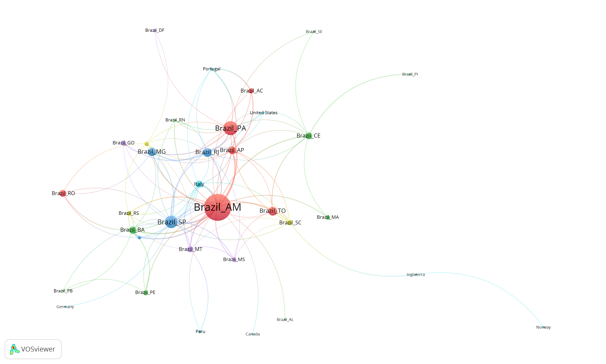
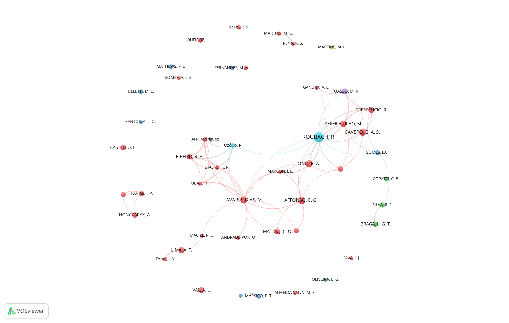
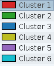
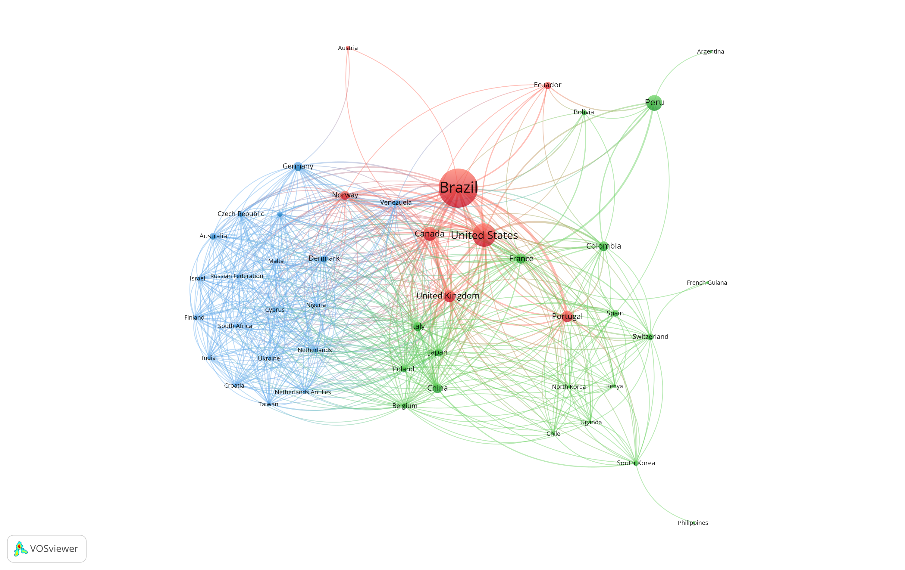
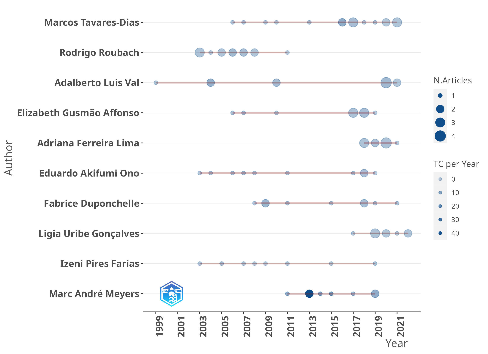
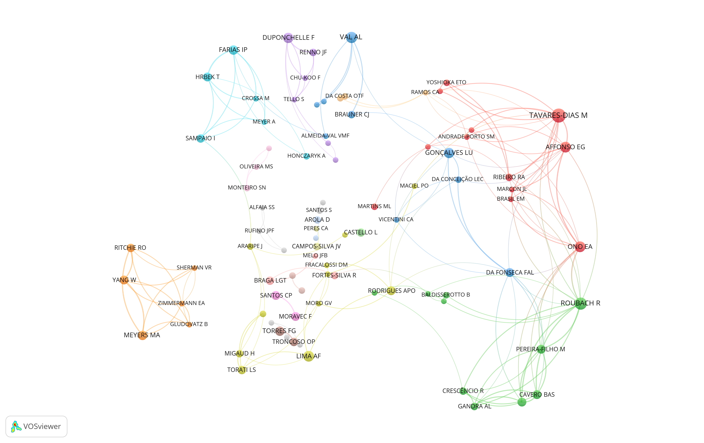

--- 
title: "Pirarucu"
author: "Roney Fraga Souza"
date: "`r format(Sys.time(), '%d %B %Y - %T')`"
site: bookdown::bookdown_site
documentclass: book
bibliography: [referencias.bib, packages.bib]
# url: your book url like https://roneyfraga.com/projects/year-project-name
# cover-image: path to the social sharing image like images/cover.jpg
csl: abnt-ipea.csl
link-citations: yes
---

# Introduction {#intro}

Análise da literatura científica sobre Pirarucu.

```{r include=FALSE}
knitr::opts_chunk$set(cache = TRUE)
options(scipen = 999)
# options(width=80)
```

<!--
Opções no chunk

eval        incluir o resultado do código executado, pode ser logico ou numérico
echo        mostrar o código 
warning     mostrar mensagens de aviso
error       mostrar mensagens de erro
message     mostrar mensagens
tidy        mostrar ajustar o código ao display, ignora identação
comment     '##' ou qq símbolo, para os resultados dos códigos serem antecedidos por ##
include     se falso, executa mas não inclui o chunk no relatório
-->


```{r eval = T, echo = F, warning = F, error = T, tidy = F, message = F}

# carregar pacotes
library(pipeR) 
library(rio) 
library(bibliometrix)
library(dplyr) 
library(tidyr)
library(fs) 
library(purrr) 
library(janitor)
library(stringr)
library(stringi)
library(rcrossref)
library(ggplot2)
library(highcharter)
library(igraph)
library(ggraph)
library(tidygraph)
library(visNetwork)
library(DT) 
library(birddog)
library(tictoc)

# dealing with text
library(textclean)
library(tm)
library(SnowballC)
library(RecordLinkage)
# topic model
library(tidytext)
library(topicmodels)
library(textmineR)
library(stm)

source('utils.R')

caminho <- '/mnt/raid0/Pessoal/'
# caminho <- '~/'
```

```{r include=FALSE}
# automatically create a bib database for R packages
knitr::write_bib(devtools::session_info()$packages$package, 'packages.bib')
```


<!--chapter:end:index.Rmd-->


# Methodology {#methodology}

## Topic Modeling  

Wikipedia description:

* _In machine learning and natural language processing, a topic model is a type of statistical model for discovering the abstract "topics" that occur in a collection of documents. Topic modeling is a frequently used text-mining tool for discovery of hidden semantic structures in a text body._

Tutoriais:

* [A Friendly Introduction to Text Clustering](https://medium.com/swlh/topic-modeling-in-r-with-tidytext-and-textminer-package-latent-dirichlet-allocation-764f4483be73)
* [YT Short Introduction to Topic Modeling](https://www.youtube.com/watch?v=p1I9Sa1lRvk)
* [YT Introduction to Topic Modeling with R](https://www.youtube.com/watch?v=IUAHUEy1V0Q)
* [YT David Blei Palestra](https://www.youtube.com/watch?v=FkckgwMHP2s&t=490s)


* STM - Structural Topic Modeling [@roberts2016]
    * permite utilizar os metadados dos documentos para melhorar a classificação
        * data da publicação, revista, etc 

* STM é uma versão atualizada do famoso método LDA [@blei2012]

Crítico definir o número de tópicos [@kim2020]:

* __semantic coherence__ reflects the fact that high-probability terms of a topic tend to occur together across documents under analysis [@roberts2016]. 
* __exclusivity__ of topic terms dictates that high-probability terms in one topic should not overlap with high-probability terms in other topics, and that high-probability terms be unique and exclusive to one topic only [@bischof2012].

* Outros trabalhos sobre topic modeling: @kuhn2018, @chen2020, @chen2020b, @hsu2019, @lee2020, @qian2021, @ranaei2019, @tontodimamma2020.


<!--chapter:end:00_methodology.Rmd-->


# Lattes Geral {#lattes}

Argumento que apenas parte da ciência esta contida no Scopus ou Web of Science, como destacado por:

* @beigel2014
* @beigel2018
* @mugnaini2019

Beigel apresenta 4 circuitos de divulgação científica, nosso trabalho pode estar em:

* (c) regional Southern circuits; e ou 
* (d) national circuits based on local publications

@mugnaini2019 apresenta quando do Lattes esta indexado no WoS ou Scopus. Importante argumento para ajudar a vender a ideia de utilizar o Lattes.

@rodrigues2015 indicam que apenas 314 periódicos científicos brasileiros estavam indexados nas bases Scopus ou WoS em 2015.

@nascimento2021 analisou a taxa de crescimento das ciência brasileira.

@Albanna2021 Publication outperformance among global South researchers.

## Grandes números

| Documento                | Quantidade |
|--------------------------|------------|
| artigos                  | 497        |
| livros                   | 35         |
| capítulos de livros      | 87         |
| projetos                 | 568        |
| monografias              | 165        |
| dissertações de mestrado | 115        |
| teses de doutorado       | 62         |


## Artigos do Lattes por Estado

Artigos com dois ou mais autores do mesmo estados foram normalizados, apenas um autor conta para cada estado.

```{r eval = T, echo = F}

rio::import('rawfiles/endereco3.rds') ->
    endereco3

rio::import('rawfiles/artigos.rds') |>
    tibble::tibble() ->
    artigos

artigos |>
    dplyr::left_join(endereco3) |>
    dplyr::group_by(titulo_do_artigo, uf2) |>
    dplyr::distinct(.keep_all = T) |>
    dplyr::ungroup() |>
    dplyr::count(uf2, sort = T) |>
    datatable(
        extensions = 'Buttons', 
        rownames = F, 
        options = list(
                    dom = 'Bfrtip', 
                    pageLength = 10, 
                    buttons = list(list(
                                        extend = 'collection', 
                                        buttons = list(list(extend = 'csv', filename = 'data'), 
                                                        list(extend = 'excel', filename = 'data')), 
                                                        text = 'Download'))))


```

Lista de artigos. 

```{r eval = T, echo = F}

artigos |> 
    dplyr::select(- id, - doi) |>
    dplyr::distinct(titulo_do_artigo, .keep_all = T) |>
    datatable(
        extensions = 'Buttons', 
        rownames = F, 
        options = list(
                    dom = 'Bfrtip', 
                    pageLength = 5, 
                    buttons = list(list(
                                        extend = 'collection', 
                                        buttons = list(list(extend = 'csv', filename = 'data'), 
                                                        list(extend = 'excel', filename = 'data')), 
                                                        text = 'Download'))))


``` 

## Livros do Lattes 

```{r eval = T, echo = F}

rio::import('rawfiles/livros.rds') |>
    dplyr::mutate(uf2 = '') ->
    livros

# rio::export(livros, 'rawfiles/livros.xlsx')

livros |>
    dplyr::select(- uf2) |> 
    dplyr::left_join(endereco3) |>
    dplyr::filter(!is.na(uf2)) |> 
    dplyr::group_by(titulo_do_livro, uf2) |>
    dplyr::distinct(.keep_all = T) |>
    dplyr::ungroup() |>
    dplyr::count(uf2, sort = T) |>
    datatable(
        extensions = 'Buttons', 
        rownames = F, 
        options = list(
                    dom = 'Bfrtip', 
                    pageLength = 10, 
                    buttons = list(list(
                                        extend = 'collection', 
                                        buttons = list(list(extend = 'csv', filename = 'data'), 
                                                        list(extend = 'excel', filename = 'data')), 
                                                        text = 'Download'))))

```

Lista de livros.


```{r eval = T, echo = F}

livros |> 
    dplyr::select(titulo_do_livro, ano, isbn) |>
    dplyr::distinct(titulo_do_livro, .keep_all = T) |>
    datatable(
        extensions = 'Buttons', 
        rownames = F, 
        options = list(
                    dom = 'Bfrtip', 
                    pageLength = 5, 
                    buttons = list(list(
                                        extend = 'collection', 
                                        buttons = list(list(extend = 'csv', filename = 'data'), 
                                                        list(extend = 'excel', filename = 'data')), 
                                                        text = 'Download'))))


``` 

## Capítulos de Livros do Lattes 

```{r eval = T, echo = F}

rio::import('rawfiles/capitulos_livros.rds') |>
    tibble::tibble() ->
    capitulos_livros

capitulos_livros |>
    dplyr::left_join(endereco3) |>
    dplyr::filter(!is.na(uf2)) |> 
    dplyr::group_by(titulo_do_capitulo_do_livro, uf2) |>
    dplyr::distinct(.keep_all = T) |>
    dplyr::ungroup() |>
    dplyr::count(uf2, sort = T) |>
    datatable(
        extensions = 'Buttons', 
        rownames = F, 
        options = list(
                    dom = 'Bfrtip', 
                    pageLength = 10, 
                    buttons = list(list(
                                        extend='collection', 
                                        buttons = list( list(extend = 'csv', filename = 'data'), 
                                                        list(extend = 'excel', filename = 'data')), 
                                                        text='Download'))))

```

List de capítulos de livros.

```{r eval = T, echo = F}

capitulos_livros |> 
    dplyr::select(titulo_do_capitulo_do_livro, ano, isbn) |>
    dplyr::distinct(titulo_do_capitulo_do_livro, .keep_all = T) |>
    datatable(
        extensions = 'Buttons', 
        rownames = F, 
        options = list(
                    dom = 'Bfrtip', 
                    pageLength = 5, 
                    buttons = list(list(
                                        extend = 'collection', 
                                        buttons = list(list(extend = 'csv', filename = 'data'), 
                                                        list(extend = 'excel', filename = 'data')), 
                                                        text = 'Download'))))


``` 


## Projetos do Lattes 

```{r eval = T, echo = F}

rio::import('rawfiles/projetos.rds') |>
    tibble::tibble() ->
    projetos

projetos |>
    dplyr::left_join(endereco3) |>
    dplyr::filter(!is.na(uf2)) |> 
    dplyr::group_by(nome_do_projeto, uf2) |>
    dplyr::distinct(.keep_all = T) |>
    dplyr::ungroup() |>
    dplyr::count(uf2, sort = T) |>
    datatable(
        extensions = 'Buttons', 
        rownames = F, 
        options = list(
                    dom = 'Bfrtip', 
                    pageLength = 10, 
                    buttons = list(list(
                                        extend='collection', 
                                        buttons = list( list(extend = 'csv', filename = 'data'), 
                                                        list(extend = 'excel', filename = 'data')), 
                                                        text='Download'))))

```

Lista de projetos. 

```{r eval = T, echo = F}

projetos |> 
    dplyr::select(nome_do_projeto, ano_inicio, ano_fim) |>
    dplyr::distinct(nome_do_projeto, .keep_all = T) |>
    datatable(
        extensions = 'Buttons', 
        rownames = F, 
        options = list(
                    dom = 'Bfrtip', 
                    pageLength = 5, 
                    buttons = list(list(
                                        extend = 'collection', 
                                        buttons = list(list(extend = 'csv', filename = 'data'), 
                                                        list(extend = 'excel', filename = 'data')), 
                                                        text = 'Download'))))


``` 

## Monografias do Lattes 

Nome do curso.

```{r eval = T, echo = F}

rio::import('rawfiles/formacao_graduacao.rds') |>
    tibble::tibble() ->
    monografias

monografias |>
   dplyr::count(nome_curso, sort = T) |>
    datatable(
        extensions = 'Buttons', 
        rownames = F, 
        options = list(
                    dom = 'Bfrtip', 
                    pageLength = 10, 
                    buttons = list(list(
                                        extend='collection', 
                                        buttons = list( list(extend = 'csv', filename = 'data'), 
                                                        list(extend = 'excel', filename = 'data')), 
                                                        text='Download'))))

```

Universidade.

```{r eval = T, echo = F}

monografias |>
   dplyr::count(nome_instituicao, sort = T) |>
    datatable(
        extensions = 'Buttons', 
        rownames = F, 
        options = list(
                    dom = 'Bfrtip', 
                    pageLength = 10, 
                    buttons = list(list(
                                        extend='collection', 
                                        buttons = list( list(extend = 'csv', filename = 'data'), 
                                                        list(extend = 'excel', filename = 'data')), 
                                                        text='Download'))))

```

Estado.


```{r eval = T, echo = F}

monografias |>
    dplyr::select(id, nome_instituicao) |>
    dplyr::filter(id != '') |>
    dplyr::mutate(nome_instituicao = stringr::str_trim(stringi::stri_trans_general(tolower(nome_instituicao), "Latin-ASCII"))) |>
    dplyr::left_join(endereco3 |> dplyr::select(- id) |> dplyr::distinct(.keep_all = T)) ->
    monografias_uf

monografias_uf |>
    dplyr::filter(is.na(uf2)) |>
    {\(acima) rio::export(acima, 'rawfiles/monografia_nouf.xlsx')}()

rio::import('rawfiles/monografia_nouf_v2.xlsx') |>
    tibble::as_tibble() |>
    dplyr::filter(!is.na(uf2)) |>
    dplyr::bind_rows(monografias_uf) |>
    dplyr::group_by(id, nome_instituicao) |>
    dplyr::distinct(.keep_all = TRUE) |>
    dplyr::ungroup() |>
    dplyr::count(uf2, sort = T) |>
    dplyr::filter(!is.na(uf2)) |> 
    datatable(
        extensions = 'Buttons', 
        rownames = F, 
        options = list(
                    dom = 'Bfrtip', 
                    pageLength = 10, 
                    buttons = list(list(
                                        extend='collection', 
                                        buttons = list( list(extend = 'csv', filename = 'data'), 
                                                        list(extend = 'excel', filename = 'data')), 
                                                        text='Download'))))

```


## Dissertações do Lattes 

Nome do curso.

```{r eval = T, echo = F}

rio::import('rawfiles/formacao_mestrado.rds') |>
    tibble::tibble() ->
    mestrado

mestrado |>
    dplyr::count(nome_curso, sort = T) |> 
    datatable(
        extensions = 'Buttons', 
        rownames = F, 
        options = list(
                    dom = 'Bfrtip', 
                    pageLength = 5, 
                    buttons = list(list(
                                        extend='collection', 
                                        buttons = list( list(extend = 'csv', filename = 'data'), 
                                                        list(extend = 'excel', filename = 'data')), 
                                                        text='Download'))))

```

Universidade.

```{r eval = T, echo = F}

mestrado |>
   dplyr::count(nome_instituicao, sort = T) |>
    datatable(
        extensions = 'Buttons', 
        rownames = F, 
        options = list(
                    dom = 'Bfrtip', 
                    pageLength = 10, 
                    buttons = list(list(
                                        extend='collection', 
                                        buttons = list( list(extend = 'csv', filename = 'data'), 
                                                        list(extend = 'excel', filename = 'data')), 
                                                        text='Download'))))

```

Estado.


```{r eval = T, echo = F}

mestrado |>
    dplyr::select(id, nome_instituicao) |>
    dplyr::filter(id != '') |>
    dplyr::mutate(nome_instituicao = stringr::str_trim(stringi::stri_trans_general(tolower(nome_instituicao), "Latin-ASCII"))) |>
    dplyr::left_join(endereco3 |> dplyr::select(- id) |> dplyr::distinct(.keep_all = T)) ->
    mestrado_uf

mestrado_uf |>
    dplyr::filter(is.na(uf2)) |>
    {\(acima) rio::export(acima, 'rawfiles/mestrado_nouf.xlsx')}()

rio::import('rawfiles/mestrado_nouf_v2.xlsx') |>
    tibble::as_tibble() |>
    dplyr::filter(!is.na(uf2)) |>
    dplyr::bind_rows(mestrado_uf) |>
    dplyr::group_by(id, nome_instituicao) |>
    dplyr::distinct(.keep_all = TRUE) |>
    dplyr::ungroup() |>
    dplyr::count(uf2, sort = T) |>
    dplyr::filter(!is.na(uf2)) |> 
    datatable(
        extensions = 'Buttons', 
        rownames = F, 
        options = list(
                    dom = 'Bfrtip', 
                    pageLength = 10, 
                    buttons = list(list(
                                        extend='collection', 
                                        buttons = list( list(extend = 'csv', filename = 'data'), 
                                                        list(extend = 'excel', filename = 'data')), 
                                                        text='Download'))))

```

## Teses do Lattes 

```{r eval = T, echo = F}

rio::import('rawfiles/formacao_doutorado.rds') |>
    tibble::tibble() ->
    doutorado

doutorado |>
    dplyr::count(nome_curso, sort = T) |>
        datatable(
        extensions = 'Buttons', 
        rownames = F, 
        options = list(
                    dom = 'Bfrtip', 
                    pageLength = 5, 
                    buttons = list(list(
                                        extend='collection', 
                                        buttons = list( list(extend = 'csv', filename = 'data'), 
                                                        list(extend = 'excel', filename = 'data')), 
                                                        text='Download'))))

```

Universidade.

```{r eval = T, echo = F}

doutorado |>
   dplyr::count(nome_instituicao, sort = T) |>
    datatable(
        extensions = 'Buttons', 
        rownames = F, 
        options = list(
                    dom = 'Bfrtip', 
                    pageLength = 10, 
                    buttons = list(list(
                                        extend='collection', 
                                        buttons = list( list(extend = 'csv', filename = 'data'), 
                                                        list(extend = 'excel', filename = 'data')), 
                                                        text='Download'))))

```

Estado.

```{r eval = T, echo = F}

doutorado |>
    dplyr::select(id, nome_instituicao) |>
    dplyr::filter(id != '') |>
    dplyr::mutate(nome_instituicao = stringr::str_trim(stringi::stri_trans_general(tolower(nome_instituicao), "Latin-ASCII"))) |>
    dplyr::left_join(endereco3 |> dplyr::select(- id) |> dplyr::distinct(.keep_all = T)) ->
    doutorado_uf

doutorado_uf |>
    dplyr::filter(is.na(uf2)) |>
    {\(acima) rio::export(acima, 'rawfiles/doutorado_nouf.xlsx')}()

rio::import('rawfiles/doutorado_nouf_v2.xlsx') |>
    tibble::as_tibble() |>
    dplyr::filter(!is.na(uf2)) |>
    dplyr::bind_rows(doutorado_uf) |>
    dplyr::group_by(id, nome_instituicao) |>
    dplyr::distinct(.keep_all = TRUE) |>
    dplyr::ungroup() |>
    dplyr::count(uf2, sort = T) |>
    dplyr::filter(!is.na(uf2)) |> 
    datatable(
        extensions = 'Buttons', 
        rownames = F, 
        options = list(
                    dom = 'Bfrtip', 
                    pageLength = 10, 
                    buttons = list(list(
                                        extend='collection', 
                                        buttons = list( list(extend = 'csv', filename = 'data'), 
                                                        list(extend = 'excel', filename = 'data')), 
                                                        text='Download'))))

```

## Artigos - rede colaboração entre estados 

```{r eval = T, echo = F}

artigos |>
    dplyr::left_join(endereco3) |>
    dplyr::arrange(titulo_do_artigo) |> 
    dplyr::filter(!is.na(uf2)) |>
    dplyr::group_by(titulo_do_artigo, uf2) |>
    dplyr::distinct(.keep_all = T) |>
    dplyr::ungroup() ->
    artigos3

# add primary key by article: que se repete quando o artigo tem mais de 1 autor
artigos3 |> 
    dplyr::group_by(titulo_do_artigo) |> 
    dplyr::group_indices(titulo_do_artigo) ->  
    artigos3$pmk 

artigos3 |> 
    dplyr::arrange(pmk) -> 
    artigos3

# artigos3 |>
#     dplyr::mutate(PY = as.numeric(ano_do_artigo)) |>
#     dplyr::count(PY, sort = F) |>
#     print(n = Inf)

# gerando edges
artigos3 |> dplyr::select(pmk, uf2) |>  dplyr::arrange(pmk) -> temp
temp2 <- split(temp, f = temp$pmk)
temp2 <- lapply(temp2, function(x) {as.character(x$uf2)})
idv <- temp2
temp2 <- lapply(temp2, function(x) {expand.grid.unique(x, x, include.equals = F)})

temp2 %>>%
    dplyr::bind_rows() %>>%
    (aggregate(list(weight = rep(1, nrow(.))), ., length)) %>>%
    (dplyr::arrange(., - weight)) %>>%
    (tibble::as_tibble(.) -> ide)

# gerando vertices
idv <- unlist(idv) 
idv2 <- idv[!duplicated(idv)]
names(idv2) <- NULL

artigos3 %>>% 
    dplyr::count(uf2, name = 'qtde_artigos') %>>% 
    dplyr::rename(name = uf2) %>>% 
    (. -> aa)

graph.data.frame(ide, directed = FALSE, vertices = idv2) %>>%
    (as_tbl_graph(.) -> net)

net %>>%
    activate(nodes) %>>%
    left_join(aa) %>>%
    tidygraph::activate(nodes) %>>%
    dplyr::filter(!is.na(qtde_artigos)) %>>%
    dplyr::filter(name != 'Brasil') %>>%
    dplyr::mutate(id = name) %>>% 
    (. -> net)

V(net)$estado <- gsub('Brasil_', '', (V(net)$name))

import('rawfiles/sigla_estados.csv') |>
    tibble::as_tibble() |>
    dplyr::mutate(regiao_id = str_sub(co_uf, 1, 1)) |>
    dplyr::select(estado = sigla_uf, regiao, regiao_id) ->
    bb

net %>>%
    activate(nodes) |>
    left_join(bb) |>
    dplyr::mutate(regiao = ifelse(is.na(regiao), 'Exterior', regiao)) |>
    dplyr::mutate(regiao_id = ifelse(is.na(regiao_id), 6, regiao_id)) ->
    net

# exportar para o vosviewer 
write_graph(net, file = 'networks/netocuf.net', format = c("pajek"))
writePajek(V(net)$qtde_artigos, 'networks/netocuf_qtde.vec')
writePajek(V(net)$regiao_id, 'networks/netocuf_regiao.clu')
```

VosViewer - Fractionalization - Attraction 6 Repulsion 1

Cores dos nós por região do Brasil, ou país estrangeiro. Tamanho do nó por quantidade de artigos por região. 


[png file](networks/netocuf.png)


## Artigos - rede colaboração entre autores

```{r eval = T, echo = F}

artigos |>
    dplyr::left_join(endereco3) |>
    dplyr::arrange(titulo_do_artigo) |> 
    dplyr::filter(!is.na(uf2)) |>
    dplyr::group_by(titulo_do_artigo, uf2) |>
    dplyr::distinct(.keep_all = T) |>
    dplyr::ungroup() ->
    artigos3

# add primary key by article: que se repete quando o artigo tem mais de 1 autor
artigos3 |> 
    dplyr::group_by(titulo_do_artigo) |> 
    dplyr::group_indices(titulo_do_artigo) ->  
    artigos3$pmk 

artigos3 |> 
    dplyr::arrange(pmk) -> 
    artigos3

# gerando edges
artigos3 |> dplyr::select(pmk, id) |>  dplyr::arrange(pmk) -> temp
temp2 <- split(temp, f = temp$pmk)
temp2 <- lapply(temp2, function(x) {as.character(x$id)})
idv <- temp2
temp2 <- lapply(temp2, function(x) {expand.grid.unique(x, x, include.equals = F)})

temp2 %>>%
    bind_rows() %>>%
    (aggregate(list(weight = rep(1, nrow(.))), ., length)) %>>%
    (arrange(., - weight)) %>>%
    (as_tibble(.) -> ide)

# gerando vertices
idv <- unlist(idv) 
idv2 <- idv[!duplicated(idv)]
names(idv2) <- NULL

artigos3 %>>% 
    count(id, name = 'qtde_artigos') %>>% 
    rename(name = id) %>>% 
    (. -> aa)

graph.data.frame(ide, directed = FALSE, vertices = idv2) %>>%
    (as_tbl_graph(.) -> net)

# nome curto
rio::import('rawfiles/dados_gerais.rds') |> 
    dplyr::select(name = id, citar_como = nome_em_citacoes_bibliograficas, nome_completo) |>
    dplyr::mutate(citar_como = gsub(';.*$', '', citar_como)) ->
    citar_como

net %>>%
    activate(nodes) %>>%
    dplyr::left_join(aa) %>>%
    tidygraph::activate(nodes) %>>%
    dplyr::filter(!is.na(qtde_artigos)) %>>%
    dplyr::left_join(citar_como) %>>%
    dplyr::left_join(endereco3 |> dplyr::select(name = id, uf2)) %>>%
    dplyr::rename(id = citar_como) %>>%
    (. -> net)

net %>>%
    activate(nodes) |>
    dplyr::mutate(estado = gsub('Brasil_', '', uf2)) |> 
    left_join(bb) |>
    dplyr::mutate(regiao = ifelse(is.na(regiao), 'Exterior', regiao)) |>
    dplyr::mutate(regiao_id = ifelse(is.na(regiao_id), 6, regiao_id)) ->
    net

net |>
    activate(nodes) |>
    dplyr::filter(qtde_artigos > 3) ->
    net

# exportar para o vosviewer 
# write_graph(net, file = 'networks/netcolaut.net', format = c("pajek")) # sobrenomes normalizados na mão
writePajek(V(net)$qtde_artigos, 'networks/netcolaut_qtde.vec')
writePajek(V(net)$regiao_id, 'networks/netcolaut_regiao.clu')
```

VosViewer - Association Strength - Attraction 6 Repulsion 0

Autores com 5 ou mais artigos.


[png file](networks/netcolaut.png)

Cores das regiões


[png file](networks/cores_grupos_regioes.png)

* Cluster 1 = Norte
* Cluster 2 = Nordeste
* Cluster 3 = Sudeste
* Cluster 4 = Sul
* Cluster 5 = Centro-Oeste
* Cluster 6 = Exterior

## Pricipais autores do Lattes

Os endereços foram obtivos via cadastro do endereço profissional do Lattes, ou do local da tese, mestrado e monografia, seguindo esta ordem.

É útil conferir os endereços dos principais autores.

```{r eval = T, echo = F}

net |>
    activate(nodes) |>
    tibble::as_tibble() |>
    dplyr::arrange(dplyr::desc(qtde_artigos)) |>
    dplyr::mutate(id, link = paste0('http://lattes.cnpq.br/', name)) |>
    dplyr::select(nome_completo, qtde_artigos, uf2, link) |>
    datatable(
        extensions = 'Buttons', 
        rownames = F, 
        options = list(
                    dom = 'Bfrtip', 
                    pageLength = 10, 
                    buttons = list(list(
                                        extend='collection', 
                                        buttons = list( list(extend = 'csv', filename = 'data'), 
                                                        list(extend = 'excel', filename = 'data')), 
                                                        text='Download'))))

```


<!--chapter:end:01_lattes.Rmd-->


# Lattes Projetos

Tipos de projetos.

```{r, eval = T, echo = F}

rio::import('rawfiles/projetos.rds') |>
    tibble::tibble() ->
    projetos

rio::export(projetos, 'rawfiles/projetos.xlsx')

projetos |>
    dplyr::group_by(natureza, situacao) |>
    tally(name = 'quantidade') |>
        datatable(
        extensions = 'Buttons', 
        rownames = F, 
        options = list(
                    dom = 'Bfrtip', 
                    pageLength = 12, 
                    buttons = list(list(
                                        extend = 'collection', 
                                        buttons = list(list(extend = 'csv', filename = 'data'), 
                                                        list(extend = 'excel', filename = 'data')), 
                                                        text = 'Download'))))
```

[Excel dos Projetos.](rawfiles/projetos.xlsx)

```{r, eval = T, echo = F}

projetos |>
    dplyr::filter(natureza == 'PESQUISA') ->
    pesq

pesq |>
    dplyr::mutate(texto = paste(nome_do_projeto, descricao_do_projeto, sep = '. ')) |>
    dplyr::mutate(title = textcleaner(nome_do_projeto)) |> 
    dplyr::distinct(title, .keep_all = TRUE) ->
    pesq

pesq |> 
    dplyr::count(ano_inicio, name = 'quantidade') |> 
        datatable(
        extensions = 'Buttons', 
        rownames = F, 
        options = list(
                    dom = 'Bfrtip', 
                    pageLength = 26, 
                    buttons = list(list(
                                        extend = 'collection', 
                                        buttons = list(list(extend = 'csv', filename = 'data'), 
                                                        list(extend = 'excel', filename = 'data')), 
                                                        text = 'Download'))))

```

Financiadores dos projetos.

```{r, eval = T, echo = F}

projetos |>
    dplyr::select(nome_do_projeto, id, financiadores) |>
    tidyr::unnest(financiadores) |>
    dplyr::group_by(nome_do_projeto) |>
    dplyr::summarise(nome_instituicao = nome_instituicao, codigo_instituicao = codigo_instituicao) |>
    dplyr::filter(nome_instituicao != '') |>
    dplyr::ungroup() |>
    dplyr::group_by(nome_instituicao, codigo_instituicao) |>
    dplyr::tally(name = 'qtde', sort = T)  |>
    {\(x) rio::export(x, 'rawfiles/lattes_projetos_financiadores.xlsx')}() 

```

## Tópicos - Modelo 1

Incluir título do projeto e descrição dos projetos para serem analisados via Structural Topic Modeling.

Após retirar os projetos duplicados, quando dois ou mais pesquisadores lançam o mesmo projeto no currículo Lattes, temos:

* 470 projetos de pesquisa
* 125 projetos sem descrição, nestes utilizamos apenas os títulos para minerar o texto 

### Topic Modeling 

```{r, eval = T, echo = F}

stm::textProcessor(documents = pesq$texto, 
                   metadata = pesq[, c('nome_do_projeto', 'descricao_do_projeto', 'ano_inicio', 'ano_fim')], 
                   lowercase = TRUE,               
                   removestopwords = TRUE,        
                   removenumbers = FALSE,        
                   removepunctuation = TRUE,    
                   stem = TRUE,                
                   wordLengths = c(3, Inf),   
                   sparselevel = 1,          
                   language = "pt",         
                   verbose = TRUE,         
                   onlycharacter = TRUE,  
                   striphtml = FALSE,       
                   customstopwords = NULL,  
                   v1 = FALSE) ->
    pesq_prep

# class(pesq_prep)
# names(pesq_prep)

stm::prepDocuments(pesq_prep$documents, 
                   pesq_prep$vocab, 
                   pesq_prep$meta, 
                   lower.thresh = 3) ->
    pesq_doc 
# names(pesq_doc)

# pesq_prep$documents |> head()
# pesq_prep$vocab |> head()
# pesq_prep$meta |> head()

# ------------------------------
## search K topics

# tictoc::tic()
# stm::searchK(documents = pesq_doc$documents, 
#              vocab = pesq_doc$vocab,
#              K = c(2, 5, 10:15, 20, 25,  30, 40, 50, 60),      
#              N = 100,                                   
#              proportion = 0.5,                          
#              heldout.seed = 1234,                       
#              M = 10,                                    
#              cores = 1,                                 
#              # prevalence = ~ ano_inicio,
#              max.em.its = 75,
#              data = pesq_doc$meta,
#              init.type = "Spectral",
#              verbose = F) ->
#     pesq_searchK 
# tictoc::toc()
#
# rio::export(pesq_searchK, 'rawfiles/pesq_searchK_mod1.rds')

rio::import('rawfiles/pesq_searchK_mod1.rds') -> 
    pesq_searchK

data.frame(K = unlist(pesq_searchK$results$K),
           semcoh = unlist(pesq_searchK$results$semcoh),
           exclus = unlist(pesq_searchK$results$exclus)) ->
    res

res$cor <- ifelse(res$K %in% c(10, 14, 25), 'selecionado', 'nao')

ggplot2::ggplot(res, aes(x = semcoh, y = exclus)) +
    ggplot2::geom_point(shape = 21, size = 3, position = "identity") +
    ggplot2::geom_line() +
    ggrepel::geom_text_repel(data = res, aes(label = K), size = 6) +
    ggplot2::geom_vline(xintercept = res[res$cor == 'selecionado', 'semcoh'], linetype = 'dashed') +
    ggplot2::labs(x = 'Semantic Coherence', y = 'Exclusivity', title = 'Model 1') +
    ggplot2::theme_classic() +
    ggplot2::theme(legend.position = "none") 

```

@kuhn2018 também escolheu a quantidade de tópicos utilizando o mesmo tipo de gráfico.

3 modelos para serem analisados: 

- 10 tópicos
- 14 tópicos
- 25 tópicos

### 10 tópicos

```{r, eval = T, echo = F}
# ------------------------------
## Modeling 

# modelo sem metadados
stm(documents = pesq_doc$documents, 
    vocab = pesq_doc$vocab, 
    K = 10, 
    data = pesq_doc$meta,
    verbose = F) ->
    pesq_stm_fit

tidytext::tidy(pesq_stm_fit) |>
    dplyr::arrange(beta) |>
    dplyr::group_by(topic) |>
    dplyr::top_n(10, beta) |>
    dplyr::arrange(-beta) |>
    dplyr::select(topic, term) |>
    dplyr::summarise(terms = list(term)) |>
    dplyr::mutate(terms = purrr::map(terms, paste, collapse = ", ")) |> 
    tidyr::unnest() ->
    top_terms 

tidytext::tidy(pesq_stm_fit, matrix = "gamma", document_names = pesq_prep$meta$nome_do_projeto) |>
    group_by(topic) |>
    summarise(gamma = mean(gamma)) |>
    arrange(desc(gamma)) |>
    left_join(top_terms, by = "topic") |>
    mutate(topic = paste0("Topic ", topic), topic = reorder(topic, gamma)) ->
    gamma_terms  

gamma_terms |>
    dplyr::mutate(topic = tolower(.data$topic)) |>
    dplyr::mutate(topic = gsub(' ', '_', .data$topic)) |>
    dplyr::mutate(gamma = round(.data$gamma, digits = 3)) |> 
    DT::datatable(
        extensions = 'Buttons', 
        rownames = F, 
        options = list(
                    dom = 'Bfrtip', 
                    pageLength = 12, 
                    buttons = list(list(
                                        extend = 'collection', 
                                        buttons = list(list(extend = 'csv', filename = 'data'), 
                                                        list(extend = 'excel', filename = 'data')), 
                                                        text = 'Download'))))
```


```{r eval = T, echo = F, warning = FALSE, error = TRUE, tidy = FALSE, message = FALSE}

tidytext::tidy(pesq_stm_fit, matrix = "theta", document_names = pesq_prep$meta$nome_do_projeto) |> 
    dplyr::left_join(pesq |> dplyr::rename(document = nome_do_projeto)) |>
    dplyr::distinct(.keep_all = TRUE) |> 
    dplyr::arrange(document, topic) -> 
    gamma_documents

gamma_documents |>
    dplyr::group_by(topic) |>
    dplyr::arrange(dplyr::desc(gamma)) |>
    dplyr::slice_head(n = 200) |>
    dplyr::ungroup() ->
    gamma_documents

gamma_documents |>
    dplyr::mutate(topic = paste('topic', topic, sep = '_')) |> 
    dplyr::mutate(gamma = round(.data$gamma, digits = 3)) |> 
    dplyr::select(document, topic, gamma, ano_inicio, descricao_do_projeto) -> 
    tab_top_10

rio::export(tab_top_10, 'rawfiles/stm_tab_top_10.xlsx') 

tab_top_10 |>
    DT::datatable(
        rownames = FALSE,
        filter = 'bottom',
        extensions = 'Buttons', 
        options = list(
                    dom = 'Blfrtip', pageLength = 5,
                        columnDefs = list(list(visible = FALSE, targets = c(4))), 
                        buttons = list(list(extend = 'colvis', columns = c(0, 1, 2, 4)))
                        ))

```

[Baixar arquivo do MS Excel.](rawfiles/stm_tab_top_10.xlsx)

### 15 tópicos

```{r, eval = T, echo = F}
# ------------------------------
## Modeling 

# modelo sem metadados
stm(documents = pesq_doc$documents, 
    vocab = pesq_doc$vocab, 
    K = 15, 
    data = pesq_doc$meta,
    verbose = F) ->
    pesq_stm_fit

tidytext::tidy(pesq_stm_fit) |>
    dplyr::arrange(beta) |>
    dplyr::group_by(topic) |>
    dplyr::top_n(10, beta) |>
    dplyr::arrange(-beta) |>
    dplyr::select(topic, term) |>
    dplyr::summarise(terms = list(term)) |>
    dplyr::mutate(terms = purrr::map(terms, paste, collapse = ", ")) |> 
    tidyr::unnest() ->
    top_terms 

tidytext::tidy(pesq_stm_fit, matrix = "gamma", document_names = pesq_prep$meta$nome_do_projeto) |>
    group_by(topic) |>
    summarise(gamma = mean(gamma)) |>
    arrange(desc(gamma)) |>
    left_join(top_terms, by = "topic") |>
    mutate(topic = paste0("Topic ", topic), topic = reorder(topic, gamma)) ->
    gamma_terms  

gamma_terms |>
    dplyr::mutate(topic = tolower(.data$topic)) |>
    dplyr::mutate(topic = gsub(' ', '_', .data$topic)) |>
    dplyr::mutate(gamma = round(.data$gamma, digits = 3)) |> 
    DT::datatable(
        extensions = 'Buttons', 
        rownames = F, 
        options = list(
                    dom = 'Bfrtip', 
                    pageLength = 15, 
                    buttons = list(list(
                                        extend = 'collection', 
                                        buttons = list(list(extend = 'csv', filename = 'data'), 
                                                        list(extend = 'excel', filename = 'data')), 
                                                        text = 'Download'))))
```


```{r eval = T, echo = F, warning = FALSE, error = TRUE, tidy = FALSE, message = FALSE}

tidytext::tidy(pesq_stm_fit, matrix = "theta", document_names = pesq_prep$meta$nome_do_projeto) |> 
    dplyr::left_join(pesq |> dplyr::rename(document = nome_do_projeto)) |>
    dplyr::distinct(.keep_all = TRUE) |> 
    dplyr::arrange(document, topic) -> 
    gamma_documents

gamma_documents |>
    dplyr::group_by(topic) |>
    dplyr::arrange(dplyr::desc(gamma)) |>
    dplyr::slice_head(n = 200) |>
    dplyr::ungroup() ->
    gamma_documents

gamma_documents |>
    dplyr::mutate(topic = paste('topic', topic, sep = '_')) |> 
    dplyr::mutate(gamma = round(.data$gamma, digits = 3)) |> 
    dplyr::select(document, topic, gamma, ano_inicio, descricao_do_projeto) -> 
    tab_top_15

rio::export(tab_top_15, 'rawfiles/stm_tab_top_15.xlsx') 

tab_top_15 |>
    DT::datatable(
        rownames = FALSE,
        filter = 'bottom',
        extensions = 'Buttons', 
        options = list(
                    dom = 'Blfrtip', pageLength = 5,
                        columnDefs = list(list(visible = FALSE, targets = c(4))), 
                        buttons = list(list(extend = 'colvis', columns = c(0, 1, 2, 4)))
                        ))

```

[Baixar arquivo do MS Excel.](rawfiles/stm_tab_top_15.xlsx)


### 25 tópicos

```{r, eval = T, echo = F}
# ------------------------------
## Modeling 

# modelo sem metadados
stm(documents = pesq_doc$documents, 
    vocab = pesq_doc$vocab, 
    K = 25, 
    data = pesq_doc$meta,
    verbose = F) ->
    pesq_stm_fit

tidytext::tidy(pesq_stm_fit) |>
    dplyr::arrange(beta) |>
    dplyr::group_by(topic) |>
    dplyr::top_n(10, beta) |>
    dplyr::arrange(-beta) |>
    dplyr::select(topic, term) |>
    dplyr::summarise(terms = list(term)) |>
    dplyr::mutate(terms = purrr::map(terms, paste, collapse = ", ")) |> 
    tidyr::unnest() ->
    top_terms 

tidytext::tidy(pesq_stm_fit, matrix = "gamma", document_names = pesq_prep$meta$nome_do_projeto) |>
    group_by(topic) |>
    summarise(gamma = mean(gamma)) |>
    arrange(desc(gamma)) |>
    left_join(top_terms, by = "topic") |>
    mutate(topic = paste0("Topic ", topic), topic = reorder(topic, gamma)) ->
    gamma_terms  

gamma_terms |>
    dplyr::mutate(topic = tolower(.data$topic)) |>
    dplyr::mutate(topic = gsub(' ', '_', .data$topic)) |>
    dplyr::mutate(gamma = round(.data$gamma, digits = 3)) |> 
    DT::datatable(
        extensions = 'Buttons', 
        rownames = F, 
        options = list(
                    dom = 'Bfrtip', 
                    pageLength = 25, 
                    buttons = list(list(
                                        extend = 'collection', 
                                        buttons = list(list(extend = 'csv', filename = 'data'), 
                                                        list(extend = 'excel', filename = 'data')), 
                                                        text = 'Download'))))
```


```{r eval = T, echo = F, warning = FALSE, error = TRUE, tidy = FALSE, message = FALSE}

tidytext::tidy(pesq_stm_fit, matrix = "theta", document_names = pesq_prep$meta$nome_do_projeto) |> 
    dplyr::left_join(pesq |> dplyr::rename(document = nome_do_projeto)) |>
    dplyr::distinct(.keep_all = TRUE) |> 
    dplyr::arrange(document, topic) -> 
    gamma_documents

gamma_documents |>
    dplyr::group_by(topic) |>
    dplyr::arrange(dplyr::desc(gamma)) |>
    dplyr::slice_head(n = 200) |>
    dplyr::ungroup() ->
    gamma_documents

gamma_documents |>
    dplyr::mutate(topic = paste('topic', topic, sep = '_')) |> 
    dplyr::mutate(gamma = round(.data$gamma, digits = 3)) |> 
    dplyr::select(document, topic, gamma, ano_inicio, descricao_do_projeto) -> 
    tab_top_25

rio::export(tab_top_25, 'rawfiles/stm_tab_top_25.xlsx') 

tab_top_25 |>
    DT::datatable(
        rownames = FALSE,
        filter = 'bottom',
        extensions = 'Buttons', 
        options = list(
                    dom = 'Blfrtip', pageLength = 5,
                        columnDefs = list(list(visible = FALSE, targets = c(4))), 
                        buttons = list(list(extend = 'colvis', columns = c(0, 1, 2, 4)))
                        ))

```

[Baixar arquivo do MS Excel.](rawfiles/stm_tab_top_25.xlsx)

## Tópicos - Modelo 2

Apenas a descrição do projeto foi utilizada.

```{r, eval = T, echo = F}

projetos |>
    dplyr::filter(natureza == 'PESQUISA') ->
    pesq

pesq |>
    dplyr::mutate(texto = paste(descricao_do_projeto, sep = '. ')) |>
    dplyr::mutate(title = textcleaner(nome_do_projeto)) |> 
    dplyr::distinct(title, .keep_all = TRUE) ->
    pesq
```

### Topic Modeling 

```{r, eval = T, echo = F}

stm::textProcessor(documents = pesq$texto, 
                   metadata = pesq[, c('nome_do_projeto', 'descricao_do_projeto', 'ano_inicio', 'ano_fim')], 
                   lowercase = TRUE,               
                   removestopwords = TRUE,        
                   removenumbers = FALSE,        
                   removepunctuation = TRUE,    
                   stem = TRUE,                
                   wordLengths = c(3, Inf),   
                   sparselevel = 1,          
                   language = "pt",         
                   verbose = TRUE,         
                   onlycharacter = TRUE,  
                   striphtml = FALSE,       
                   customstopwords = NULL,  
                   v1 = FALSE) ->
    pesq_prep

# class(pesq_prep)
# names(pesq_prep)

stm::prepDocuments(pesq_prep$documents, 
                   pesq_prep$vocab, 
                   pesq_prep$meta, 
                   lower.thresh = 3) ->
    pesq_doc 
# names(pesq_doc)

# pesq_prep$documents |> head()
# pesq_prep$vocab |> head()
# pesq_prep$meta |> head()

# ------------------------------
## search K topics

# tictoc::tic()
# stm::searchK(documents = pesq_doc$documents, 
#              vocab = pesq_doc$vocab,
#              K = c(2, 5, 10:15, 20, 25,  30, 40, 50, 60),      
#              N = 100,                                   
#              proportion = 0.5,                          
#              heldout.seed = 1234,                       
#              M = 10,                                    
#              cores = 1,                                 
#              # prevalence = ~ ano_inicio,
#              max.em.its = 75,
#              data = pesq_doc$meta,
#              init.type = "Spectral",
#              verbose = F) ->
#     pesq_searchK 
# tictoc::toc()
#
# rio::export(pesq_searchK, 'rawfiles/pesq_searchK_mod2.rds')

rio::import('rawfiles/pesq_searchK_mod2.rds') -> 
    pesq_searchK

data.frame(K = unlist(pesq_searchK$results$K),
           semcoh = unlist(pesq_searchK$results$semcoh),
           exclus = unlist(pesq_searchK$results$exclus)) ->
    res

res$cor <- ifelse(res$K %in% c(10, 11, 13, 25), 'selecionado', 'nao')

ggplot2::ggplot(res, aes(x = semcoh, y = exclus)) +
    ggplot2::geom_point(shape = 21, size = 3, position = "identity") +
    ggplot2::geom_line() +
    ggrepel::geom_text_repel(data = res, aes(label = K), size = 6) +
    ggplot2::geom_vline(xintercept = res[res$cor == 'selecionado', 'semcoh'], linetype = 'dashed') +
    ggplot2::labs(x = 'Semantic Coherence', y = 'Exclusivity', title = 'Model 2') +
    ggplot2::theme_classic() +
    ggplot2::theme(legend.position = "none") 

```

4 modelos para serem analisados: 

- 10 tópicos
- 11 tópicos
- 13 tópicos
- 25 tópicos


### 10 tópicos

```{r, eval = T, echo = F}
# ------------------------------
## Modeling 

# modelo sem metadados
stm(documents = pesq_doc$documents, 
    vocab = pesq_doc$vocab, 
    K = 10, 
    data = pesq_doc$meta,
    verbose = F) ->
    pesq_stm_fit

tidytext::tidy(pesq_stm_fit) |>
    dplyr::arrange(beta) |>
    dplyr::group_by(topic) |>
    dplyr::top_n(10, beta) |>
    dplyr::arrange(-beta) |>
    dplyr::select(topic, term) |>
    dplyr::summarise(terms = list(term)) |>
    dplyr::mutate(terms = purrr::map(terms, paste, collapse = ", ")) |> 
    tidyr::unnest() ->
    top_terms 

tidytext::tidy(pesq_stm_fit, matrix = "gamma", document_names = pesq_prep$meta$nome_do_projeto) |>
    group_by(topic) |>
    summarise(gamma = mean(gamma)) |>
    arrange(desc(gamma)) |>
    left_join(top_terms, by = "topic") |>
    mutate(topic = paste0("Topic ", topic), topic = reorder(topic, gamma)) ->
    gamma_terms  

gamma_terms |>
    dplyr::mutate(topic = tolower(.data$topic)) |>
    dplyr::mutate(topic = gsub(' ', '_', .data$topic)) |>
    dplyr::mutate(gamma = round(.data$gamma, digits = 3)) |> 
    DT::datatable(
        extensions = 'Buttons', 
        rownames = F, 
        options = list(
                    dom = 'Bfrtip', 
                    pageLength = 25, 
                    buttons = list(list(
                                        extend = 'collection', 
                                        buttons = list(list(extend = 'csv', filename = 'data'), 
                                                        list(extend = 'excel', filename = 'data')), 
                                                        text = 'Download'))))
```


```{r eval = T, echo = F, warning = FALSE, error = TRUE, tidy = FALSE, message = FALSE}

tidytext::tidy(pesq_stm_fit, matrix = "theta", document_names = pesq_prep$meta$nome_do_projeto) |> 
    dplyr::left_join(pesq |> dplyr::rename(document = nome_do_projeto)) |>
    dplyr::distinct(.keep_all = TRUE) |> 
    dplyr::arrange(document, topic) -> 
    gamma_documents

gamma_documents |>
    dplyr::group_by(topic) |>
    dplyr::arrange(dplyr::desc(gamma)) |>
    dplyr::slice_head(n = 200) |>
    dplyr::ungroup() ->
    gamma_documents

gamma_documents |>
    dplyr::mutate(topic = paste('topic', topic, sep = '_')) |> 
    dplyr::mutate(gamma = round(.data$gamma, digits = 3)) |> 
    dplyr::select(document, topic, gamma, ano_inicio, descricao_do_projeto) -> 
    tab_top_10

rio::export(tab_top_10, 'rawfiles/stm2_tab_top_10.xlsx') 

tab_top_10 |>
    DT::datatable(
        rownames = FALSE,
        filter = 'bottom',
        extensions = 'Buttons', 
        options = list(
                    dom = 'Blfrtip', pageLength = 5,
                        columnDefs = list(list(visible = FALSE, targets = c(4))), 
                        buttons = list(list(extend = 'colvis', columns = c(0, 1, 2, 4)))
                        ))

```

[Baixar arquivo do MS Excel.](rawfiles/stm2_tab_top_10.xlsx)


### 11 tópicos

```{r, eval = T, echo = F}
# ------------------------------
## Modeling 

# modelo sem metadados
stm(documents = pesq_doc$documents, 
    vocab = pesq_doc$vocab, 
    K = 11, 
    data = pesq_doc$meta,
    verbose = F) ->
    pesq_stm_fit

tidytext::tidy(pesq_stm_fit) |>
    dplyr::arrange(beta) |>
    dplyr::group_by(topic) |>
    dplyr::top_n(10, beta) |>
    dplyr::arrange(-beta) |>
    dplyr::select(topic, term) |>
    dplyr::summarise(terms = list(term)) |>
    dplyr::mutate(terms = purrr::map(terms, paste, collapse = ", ")) |> 
    tidyr::unnest() ->
    top_terms 

tidytext::tidy(pesq_stm_fit, matrix = "gamma", document_names = pesq_prep$meta$nome_do_projeto) |>
    group_by(topic) |>
    summarise(gamma = mean(gamma)) |>
    arrange(desc(gamma)) |>
    left_join(top_terms, by = "topic") |>
    mutate(topic = paste0("Topic ", topic), topic = reorder(topic, gamma)) ->
    gamma_terms  

gamma_terms |>
    dplyr::mutate(topic = tolower(.data$topic)) |>
    dplyr::mutate(topic = gsub(' ', '_', .data$topic)) |>
    dplyr::mutate(gamma = round(.data$gamma, digits = 3)) |> 
    DT::datatable(
        extensions = 'Buttons', 
        rownames = F, 
        options = list(
                    dom = 'Bfrtip', 
                    pageLength = 25, 
                    buttons = list(list(
                                        extend = 'collection', 
                                        buttons = list(list(extend = 'csv', filename = 'data'), 
                                                        list(extend = 'excel', filename = 'data')), 
                                                        text = 'Download'))))
```


```{r eval = T, echo = F, warning = FALSE, error = TRUE, tidy = FALSE, message = FALSE}

tidytext::tidy(pesq_stm_fit, matrix = "theta", document_names = pesq_prep$meta$nome_do_projeto) |> 
    dplyr::left_join(pesq |> dplyr::rename(document = nome_do_projeto)) |>
    dplyr::distinct(.keep_all = TRUE) |> 
    dplyr::arrange(document, topic) -> 
    gamma_documents

gamma_documents |>
    dplyr::group_by(topic) |>
    dplyr::arrange(dplyr::desc(gamma)) |>
    dplyr::slice_head(n = 200) |>
    dplyr::ungroup() ->
    gamma_documents

gamma_documents |>
    dplyr::mutate(topic = paste('topic', topic, sep = '_')) |> 
    dplyr::mutate(gamma = round(.data$gamma, digits = 3)) |> 
    dplyr::select(document, topic, gamma, ano_inicio, descricao_do_projeto) -> 
    tab_top_11

rio::export(tab_top_11, 'rawfiles/stm2_tab_top_11.xlsx') 

tab_top_11 |>
    DT::datatable(
        rownames = FALSE,
        filter = 'bottom',
        extensions = 'Buttons', 
        options = list(
                    dom = 'Blfrtip', pageLength = 5,
                        columnDefs = list(list(visible = FALSE, targets = c(4))), 
                        buttons = list(list(extend = 'colvis', columns = c(0, 1, 2, 4)))
                        ))

```

[Baixar arquivo do MS Excel.](rawfiles/stm2_tab_top_11.xlsx)

### 13 tópicos

```{r, eval = T, echo = F}
# ------------------------------
## Modeling 

# modelo sem metadados
stm(documents = pesq_doc$documents, 
    vocab = pesq_doc$vocab, 
    K = 13, 
    data = pesq_doc$meta,
    verbose = F) ->
    pesq_stm_fit

tidytext::tidy(pesq_stm_fit) |>
    dplyr::arrange(beta) |>
    dplyr::group_by(topic) |>
    dplyr::top_n(10, beta) |>
    dplyr::arrange(-beta) |>
    dplyr::select(topic, term) |>
    dplyr::summarise(terms = list(term)) |>
    dplyr::mutate(terms = purrr::map(terms, paste, collapse = ", ")) |> 
    tidyr::unnest() ->
    top_terms 

tidytext::tidy(pesq_stm_fit, matrix = "gamma", document_names = pesq_prep$meta$nome_do_projeto) |>
    group_by(topic) |>
    summarise(gamma = mean(gamma)) |>
    arrange(desc(gamma)) |>
    left_join(top_terms, by = "topic") |>
    mutate(topic = paste0("Topic ", topic), topic = reorder(topic, gamma)) ->
    gamma_terms  

gamma_terms |>
    dplyr::mutate(topic = tolower(.data$topic)) |>
    dplyr::mutate(topic = gsub(' ', '_', .data$topic)) |>
    dplyr::mutate(gamma = round(.data$gamma, digits = 3)) |> 
    DT::datatable(
        extensions = 'Buttons', 
        rownames = F, 
        options = list(
                    dom = 'Bfrtip', 
                    pageLength = 25, 
                    buttons = list(list(
                                        extend = 'collection', 
                                        buttons = list(list(extend = 'csv', filename = 'data'), 
                                                        list(extend = 'excel', filename = 'data')), 
                                                        text = 'Download'))))
```


```{r eval = T, echo = F, warning = FALSE, error = TRUE, tidy = FALSE, message = FALSE}

tidytext::tidy(pesq_stm_fit, matrix = "theta", document_names = pesq_prep$meta$nome_do_projeto) |> 
    dplyr::left_join(pesq |> dplyr::rename(document = nome_do_projeto)) |>
    dplyr::distinct(.keep_all = TRUE) |> 
    dplyr::arrange(document, topic) -> 
    gamma_documents

gamma_documents |>
    dplyr::group_by(topic) |>
    dplyr::arrange(dplyr::desc(gamma)) |>
    dplyr::slice_head(n = 200) |>
    dplyr::ungroup() ->
    gamma_documents

gamma_documents |>
    dplyr::mutate(topic = paste('topic', topic, sep = '_')) |> 
    dplyr::mutate(gamma = round(.data$gamma, digits = 3)) |> 
    dplyr::select(document, topic, gamma, ano_inicio, descricao_do_projeto) -> 
    tab_top_13

rio::export(tab_top_13, 'rawfiles/stm2_tab_top_13.xlsx') 

tab_top_13 |>
    DT::datatable(
        rownames = FALSE,
        filter = 'bottom',
        extensions = 'Buttons', 
        options = list(
                    dom = 'Blfrtip', pageLength = 5,
                        columnDefs = list(list(visible = FALSE, targets = c(4))), 
                        buttons = list(list(extend = 'colvis', columns = c(0, 1, 2, 4)))
                        ))

```

[Baixar arquivo do MS Excel.](rawfiles/stm2_tab_top_13.xlsx)

### 25 tópicos

```{r, eval = T, echo = F}
# ------------------------------
## Modeling 

# modelo sem metadados
stm(documents = pesq_doc$documents, 
    vocab = pesq_doc$vocab, 
    K = 25, 
    data = pesq_doc$meta,
    verbose = F) ->
    pesq_stm_fit

tidytext::tidy(pesq_stm_fit) |>
    dplyr::arrange(beta) |>
    dplyr::group_by(topic) |>
    dplyr::top_n(10, beta) |>
    dplyr::arrange(-beta) |>
    dplyr::select(topic, term) |>
    dplyr::summarise(terms = list(term)) |>
    dplyr::mutate(terms = purrr::map(terms, paste, collapse = ", ")) |> 
    tidyr::unnest() ->
    top_terms 

tidytext::tidy(pesq_stm_fit, matrix = "gamma", document_names = pesq_prep$meta$nome_do_projeto) |>
    group_by(topic) |>
    summarise(gamma = mean(gamma)) |>
    arrange(desc(gamma)) |>
    left_join(top_terms, by = "topic") |>
    mutate(topic = paste0("Topic ", topic), topic = reorder(topic, gamma)) ->
    gamma_terms  

gamma_terms |>
    dplyr::mutate(topic = tolower(.data$topic)) |>
    dplyr::mutate(topic = gsub(' ', '_', .data$topic)) |>
    dplyr::mutate(gamma = round(.data$gamma, digits = 3)) |> 
    DT::datatable(
        extensions = 'Buttons', 
        rownames = F, 
        options = list(
                    dom = 'Bfrtip', 
                    pageLength = 25, 
                    buttons = list(list(
                                        extend = 'collection', 
                                        buttons = list(list(extend = 'csv', filename = 'data'), 
                                                        list(extend = 'excel', filename = 'data')), 
                                                        text = 'Download'))))
```


```{r eval = T, echo = F, warning = FALSE, error = TRUE, tidy = FALSE, message = FALSE}

tidytext::tidy(pesq_stm_fit, matrix = "theta", document_names = pesq_prep$meta$nome_do_projeto) |> 
    dplyr::left_join(pesq |> dplyr::rename(document = nome_do_projeto)) |>
    dplyr::distinct(.keep_all = TRUE) |> 
    dplyr::arrange(document, topic) -> 
    gamma_documents

gamma_documents |>
    dplyr::group_by(topic) |>
    dplyr::arrange(dplyr::desc(gamma)) |>
    dplyr::slice_head(n = 200) |>
    dplyr::ungroup() ->
    gamma_documents

gamma_documents |>
    dplyr::mutate(topic = paste('topic', topic, sep = '_')) |> 
    dplyr::mutate(gamma = round(.data$gamma, digits = 3)) |> 
    dplyr::select(document, topic, gamma, ano_inicio, descricao_do_projeto) -> 
    tab_top_25

rio::export(tab_top_25, 'rawfiles/stm2_tab_top_25.xlsx') 

tab_top_25 |>
    DT::datatable(
        rownames = FALSE,
        filter = 'bottom',
        extensions = 'Buttons', 
        options = list(
                    dom = 'Blfrtip', pageLength = 5,
                        columnDefs = list(list(visible = FALSE, targets = c(4))), 
                        buttons = list(list(extend = 'colvis', columns = c(0, 1, 2, 4)))
                        ))

```

[Baixar arquivo do MS Excel.](rawfiles/stm2_tab_top_25.xlsx)


<!--chapter:end:02_projetos.Rmd-->


# Scopus  

Como a quantidade de documentos retornados foi a mesma para o Scopus e o WoS, 321 publicações, optei por trabalhar com o Scopus. O Scopus permite ter maior controle dos endereços dos autores via `API rscopus`.

Query

```
321 document results
( TITLE-ABS-KEY ( pirarucu )  OR  TITLE-ABS-KEY ( "arapaima gigas" ) ) 
```

Busca feita em 2022-03-28.

```{r eval = F, echo = F, warning = F, error = T, tidy = F, message = F}

M <- convert2df(file = 'bibs/scopus.bib', dbsource = "scopus", format = "bibtex")

rio::export(M, 'rawfiles/m_scopus.rds') 
```

### Rede de colaboração entre países


```{r eval = F, echo = F, warning = FALSE, error = TRUE, tidy = FALSE, message = FALSE}

rio::import('rawfiles/m_scopus.rds') -> M 

# Address Scopus API

# existe API
rscopus::have_api_key()

# ----------
## testar busca no Scopus
# M[10, ] |> dplyr::pull(TI) 

# Query <- "TITLE ('ASSESSMENT OF SMALLHOLDER FARMERS ADAPTIVE CAPACITY TO CLIMATE CHANGE : USE OF A MIXED WEIGHTING SCHEME')  AND  (LIMIT-TO ( DOCTYPE , 'ar')  OR  LIMIT-TO ( DOCTYPE ,  're' ))"

# rscopus::scopus_search(query = Query, 
#                        view = "COMPLETE", 
#                        count = 200) ->
#     x

# rscopusAffiliation(x)
# rscopusAutInsArt(x)
# rscopusAuthors(x)
# ----------

## busca para todos os documentos

p1 <- "( TITLE ( '"
p2 <- "' )  OR  DOI ("
p3 <- ") )"

M |> 
    dplyr::select(TI, DI) |>
    dplyr::mutate(query = paste0(p1, TI, p2, DI, p3)) |>
    dplyr::pull(query) ->
    query

my_scopus_search <- function(x) { 
    rscopus::scopus_search(query = x, view = "COMPLETE", count = 200) 
}

# demorado
# ser feito na rede da UFMT
query |>
    purrr::map(purrr::safely(my_scopus_search)) |>
    purrr::map(purrr::pluck, 'result') |>
    purrr::map(rscopusAffiliation) |>
    purrr::map(tibble::as_tibble) ->
    afiliacao

rio::export(afiliacao, '~/OneDrive/Rworkspace/2021-pirarucu/rawfiles/m_scopus_afilicao.rds')

# demorado
# ser feito na rede da UFMT
# buscar financiadores dos artigos

query |>                                          
    purrr::map(purrr::safely(my_scopus_search)) |>
    purrr::map(purrr::pluck, 'result') ->         
    res

rio::export(res, '/rawfiles/res.rds') 

res |>                                          
    purrr::map(purrr::safely(rscopusSponsor)) |>
    purrr::map(purrr::pluck, 'result') |>         
    dplyr::bind_rows() |>
    dplyr::group_by(fund_sponsor) |>
    dplyr::tally(name = 'qtde', sort = T) |>
    {\(x) rio::export(x, '/rawfiles/scopus_financiadores.xlsx') }() 
```

```{r eval = T, echo = F, warning = FALSE, error = TRUE, tidy = FALSE, message = FALSE}

rio::import('rawfiles/m_scopus.rds') -> 
    M 

M |>
    tibble::as_tibble() |>
    dplyr::select(SR, FU) 

rio::import('rawfiles/m_scopus_afilicao.rds') ->
    afiliacao

# gerar variável id, presente em afiliacao
M$id <- as.character(1:nrow(M))

# afiliacao |> head()

# ------------
# adicionar afiliação no arquivo M, como lista de coluna num tibble()
afiliacao |> 
    purrr::map(janitor::clean_names) |>
    dplyr::bind_rows(.id = 'id') |>
    dplyr::group_by(id) |>
    tidyr::nest() |>
    dplyr::rename(affiliation = data) |>
    dplyr::ungroup() |>
    dplyr::right_join(M) ->
    M2

M2 |> 
    dplyr::select(SR, id, affiliation)  |>
    tidyr::unnest_wider(affiliation) |>
    tidyr::unnest_longer(affiliation_country) |>
    dplyr::select(SR, id, affiliation_country) |>
    dplyr::distinct(.keep_all = TRUE) |>
    dplyr::group_by(SR, id) |>
    dplyr::summarise(qtde_paises = n()) |>
    dplyr::ungroup() ->
    artigo_qtde_paises

# retirar NULL, padronizar nomes, obter combinações de países no mesmo artigo, gerar lista de edges 
afiliacao |>
    purrr::compact() |>
    purrr::map(~ .x |> janitor::clean_names()) |>
    purrr::map(~ .x |> dplyr::pull(affiliation_country)) |>
    purrr::map(function(x) {expand.grid.unique(x, x, include.equals = F)}) |>
    dplyr::bind_rows() |>
    tibble::as_tibble() ->
    ide

c(ide$V1, ide$V2) |>
    unique() |>
    sort() ->
    idv

ide |>
    dplyr::filter(!is.na(V1)) |>
    dplyr::filter(!is.na(V2)) ->
    ide2

# criar uma rede, com pesos, normalizando A -> e B -> A com adição nos pesos
igraph::graph.data.frame(ide2, directed = FALSE, vertices = idv) |>
    {\(x) igraph::graph.adjacency(igraph::get.adjacency(x), weighted = TRUE)}() |>
    {\(x) igraph::simplify(x, remove.multiple = T, edge.attr.comb = list(weight = 'sum'))}() |>
    tidygraph::as_tbl_graph() -> 
    net

# ---------
## encontrar quantidade de artigos com ao menos um autor de cada país

M2 |>
    dplyr::select(SR, id, affiliation)  |>
    tidyr::unnest_wider(affiliation) |>
    tidyr::unnest_longer(affiliation_country) |>
    dplyr::select(SR, id, affiliation_country) |>
    dplyr::distinct(.keep_all = TRUE) |>
    dplyr::group_by(affiliation_country) |>
    dplyr::summarise(qtde_artigos = n()) |>
    dplyr::rename(name = affiliation_country) |>
    dplyr::ungroup() ->
    paises_artigos 

net |>
    tidygraph::activate(nodes) |>
    dplyr::left_join(paises_artigos) |>
    dplyr::arrange(desc(qtde_artigos)) ->
    net2

## atributos da rede
net2 |>
    tidygraph::activate(nodes) |>
    dplyr::mutate(degree = degree(net2),
                  closeness = closeness(net2),
                  betweenness = betweenness(net2)) |>
    tibble::as_tibble() ->
    net2_atributos

# ---------
## sjr 
readr::read_csv2('rawfiles/scimagojr_2019_filtrado.csv') |>
    janitor::clean_names() |>
    dplyr::arrange(desc(sjr)) |>
    tidyr::separate_rows(issn, sep = ',') |>
    dplyr::mutate(issn = stringr::str_trim(issn)) |>
    dplyr::distinct(issn, .keep_all = TRUE) ->
    sjr

M2 |> 
    dplyr::select(SR, SN, id, affiliation)  |>
    tidyr::unnest_wider(affiliation) |>
    tidyr::unnest_longer(affiliation_country) |>
    dplyr::select(SN, id, affiliation_country) |>
    dplyr::rename(issn = SN) |>
    dplyr::distinct(.keep_all = TRUE) |>
    left_join(sjr) |>
    dplyr::mutate(sjr = ifelse(is.na(sjr), 20, sjr)) ->
    m2_sjr

m2_sjr |>
    dplyr::select(id, affiliation_country, sjr) |> 
    dplyr::filter(!is.na(affiliation_country)) |> 
    dplyr::group_by(id, affiliation_country) |>
    dplyr::slice_head(n = 1) |>
    dplyr::ungroup() |>
    dplyr::group_by(affiliation_country) |>
    dplyr::summarise(sjr = sum(sjr)) |>
    dplyr::rename(name = affiliation_country) -> 
    sjr_scopus

net2_atributos |>
    dplyr::full_join(sjr_scopus) |>
    dplyr::mutate(sjr_medio = sjr / qtde_artigos) |>
    dplyr::relocate(name, qtde_artigos, sjr, sjr_medio, degree, closeness, betweenness) ->
    net2_atributos2

rio::export(net2_atributos2, 'rawfiles/m_scopus_col_cou_atributos2.xlsx') 

# para os artigos publicados em revistas sem sjr foi atribuído a pontuação de 20
artigos3 |>
    dplyr::left_join(sjr %>>% dplyr::select(issn, sjr)) |>
    dplyr::mutate(sjr = ifelse(is.na(sjr), 20, sjr)) ->
    artigos4

# ---------
## exportar para vosviewer

eb <- igraph::cluster_louvain(as.undirected(net2))

net2 |>
    tidygraph::activate(nodes) |>
    tibble::as_tibble() |>
    dplyr::mutate(eb = eb$membership) |>
    group_by(eb) |>
    slice_head(n = 4) |>
    print(n = Inf)

# exportar para o vosviewer
igraph::V(net2)$id <- igraph::V(net2)$name
igraph::write_graph(net2, file = 'networks/m_scopus_col_cou.net', format = c("pajek"))
writePajek(eb$membership, 'networks/m_scopus_col_cou_cluster.clu')
writePajek(V(net2)$qtde_artigos, 'networks/m_scopus_col_cou.vec')
```

[Rede de colaboração entre países - Scopus.](networks/m_scopus_col_cou.png)



### Taxa de crescimento 

Taxa de crescimento para os documentos obtidos no Scopus para o período de 2000 a 2021.

```{r eval = TRUE, echo = F, warning = FALSE, error = TRUE, tidy = FALSE, message = FALSE}

M <- import('rawfiles/m_scopus.rds')

M %>>%
    count(PY, sort = F, name = 'Papers') %>>%
    (~ d0) %>>%
    dplyr::filter(PY %in% c(2000:2020)) %>>% 
    dplyr::arrange(PY) %>>% 
    dplyr::mutate(trend = 1:n()) %>>% 
    (. -> d)

d$lnp <- log(d$Papers)

# ajustar parametros via mqo 
m1 <- lm(lnp ~ trend, data = d)
# summary(m1)

beta0 <- m1$coefficients[[1]]
beta1 <- m1$coefficients[[2]]

# modelo não linear
# 2000 é o primeiro ano da série
m2 <- nls(Papers ~ b0 * exp(b1 * (PY - 2000)), start = list(b0 = beta0, b1 = beta1), data = d)
# summary(m2)

# publications estimado
d$predicted <- 1.76414 * exp(0.15638 * (d$PY - 2000))

# taxa de crescimento anual é de 
# (exp(0.15638) - 1) * 100

# o período necessário para dobrar o tempo é 
# log(2) / 0.15638

d %>>% 
    mutate(Year = PY) %>>% 
    mutate(predicted = round(predicted, 0)) %>>% 
    (. -> d)

periodo <- 2000:2024
predicted <- tibble::tibble(PY = periodo, Predicted = round(1.76414 * exp(0.15638 * (periodo - 2000)), 0)) 

dplyr::full_join(d0, predicted) |>
    dplyr::rename(Year = PY) |>
    dplyr::filter(Year %in% 2000:2020) ->
    d2

# p <- ggplot2::ggplot(d2, aes(x = Year, y = Papers)) + 
#     ggplot2::geom_line(aes(x = Year, y = Papers, colour = "Papers Scopus")) + 
#     ggplot2::geom_point(aes(y = Papers, color = 'Papers Scopus')) + 
#     ggplot2::geom_line(aes(y = Predicted, color = 'Predicted Scopus'), linetype = 'longdash') + 
#     ggplot2::geom_point(aes(y = Predicted, color = 'Predicted Scopus')) + 
#     scale_x_continuous(name = 'Year', breaks = seq(2000, 2020, by = 2), limits = c(2000, 2020)) +
#     scale_y_continuous(name = 'Papers', breaks = seq(0, 45, by = 5), limits = c(0, 45)) +
#     scale_color_manual(name = "Publications", values = c("Predicted Scopus" = "red", "Papers Scopus" = "black")) +
#     theme_bw() +
#     ylab('Papers') +
#     theme(axis.text.x = element_text(angle = 90, vjust = 0.5, hjust = 1), legend.position = "bottom")

# p + ggplot2::annotate("text", x = 2009, y = 40, size = 3, label = 'Predicted Y_p = 1.76 * e ^ 0.15 (year-2000)', parse = F) 

# ggsave('images/taxa-crescimento-scopus.png', width = 10, height = 10, units = c("cm"))

highcharter::hchart(d2, "column", hcaes(x = Year, y = Papers), name = "Publications", showInLegend = TRUE) %>>%
   highcharter::hc_add_series(d2, "line", hcaes(x = Year, y = Predicted), name = "Predicted", showInLegend = TRUE) %>>% 
   highcharter::hc_add_theme(hc_theme_google()) %>>%
   highcharter::hc_navigator(enabled = TRUE)  %>>% 
   highcharter::hc_exporting(enabled = TRUE, filename = 'groups_growth') %>>%
   highcharter::hc_xAxis(plotBands = list(list(from = 2021, to = 2021, color = "#330000")))
```

Analysis 2000-2021
<ul>
  <li> Growth Rate 16.9% </li>
  <li> Doubling time  4.4 Years </li>
</ul>

__Taxa de crescimento de todo o Scopus.__

```{r eval = TRUE, echo = F, warning = FALSE, error = TRUE, tidy = FALSE, message = FALSE}

d0 <- read.table('rawfiles/Scopus-38425968-Analyze-Year.csv', header = T, sep = ',', skip = 3) 

d0 |>
    dplyr::mutate(Papers = Papers / 100000) |> 
    dplyr::filter(PY %in% c(2000:2021)) %>>% 
    dplyr::arrange(PY) %>>% 
    dplyr::mutate(trend = 1:n()) %>>% 
    (. -> d)

d$lnp <- log(d$Papers)

# ajustar parametros via mqo 
m1 <- lm(lnp ~ trend, data = d)
# summary(m1)

beta0 <- m1$coefficients[[1]]
beta1 <- m1$coefficients[[2]]

# modelo não linear
# 2000 é o primeiro ano da série
m2 <- nls(Papers ~ b0 * exp(b1 * (PY - 2000)), start = list(b0 = beta0, b1 = beta1), data = d)
# summary(m2)

# publications estimado
d$predicted <- 1.26206 * exp(0.169719 * (d$PY - 1990))

# taxa de crescimento anual é de 
# (exp(0.052582) - 1) * 100

# o período necessário para dobrar o tempo é 
# log(2) / 0.052582
```

Analysis 2000-2021
<ul>
  <li> Growth Rate 5.5% </li>
  <li> Doubling time  13 Years </li>
</ul>

### Principais revistas

```{r eval = T , echo = F}

results <- bibliometrix::biblioAnalysis(M, sep = ";")

S <- summary(object = results, k = 10, pause = F, verbose = F)

S$MostRelSources |>
        datatable(
            extensions = 'Buttons', 
            rownames = F, 
            options = list(
                        dom = 'Bfrtip', 
                        pageLength = 10, 
                        buttons = list(list(
                                            extend = 'collection', 
                                            buttons = list(list(extend = 'csv', filename = 'data'), 
                                                            list(extend = 'excel', filename = 'data')), 
                                                            text = 'Download'))))  
```

### Trabalhos mais citados

```{r eval = T , echo = F}

M |>
    tibble::as_tibble() |>
    dplyr::select(SR, AU, PY, TI, DI, TC, DE, AB, SO) |>
    {\(x) rio::export(x, 'rawfiles/m_scopus_resumo.xlsx') }() 

S$MostCitedPapers |>
        datatable(
            extensions = 'Buttons', 
            rownames = F, 
            options = list(
                        dom = 'Bfrtip', 
                        pageLength = 10, 
                        buttons = list(list(
                                            extend = 'collection', 
                                            buttons = list(list(extend = 'csv', filename = 'data'), 
                                                            list(extend = 'excel', filename = 'data')), 
                                                            text = 'Download'))))  
```

[Baixar dados dos artigos em MS Excel.](rawfiles/m_scopus_resumo.xlsx)

### Análises por autor

```{r eval = F , echo = F}

# topAU <- authorProdOverTime(M, k = 10, graph = TRUE)

tibble::tibble(AU = c('TAVARES-DIAS M', 'ROUBACH R', 'VAL AL', 'AFFONSO EG', 'LIMA AF', 'ONO EA', 'DUPONCHELLE F', 
                      'GONÇALVES LU', 'FARIAS IP', 'MEYERS MA'), 
               nomes_completos = c('Marcos Tavares-Dias', 'Rodrigo Roubach', 'Adalberto Luis Val', 'Elizabeth Gusmão Affonso', 
  'Adriana Ferreira Lima', 'Eduardo Akifumi Ono', 'Fabrice Duponchelle', 'Ligia Uribe Gonçalves', 
  'Izeni Pires Farias', 'Marc André Meyers')) ->
      nomes_completos

# --------------------------------------------------
# authorProdOverTime alterada
# --------------------------------------------------
k = 10
graph = TRUE

if (!("DI" %in% names(M))){M$DI="NA"}
M$TC <- as.numeric(M$TC)
M$PY <- as.numeric(M$PY)
M <- M[!is.na(M$PY),] #remove rows with missing value in PY

Y <- as.numeric(substr(Sys.time(),1,4))
listAU <- (strsplit(M$AU, ";"))
nAU <- lengths(listAU)
df <- data.frame(AU=trimws(unlist(listAU)), SR=rep(M$SR,nAU)) 
AU <- df %>% 
  group_by(.data$AU) %>% 
  count() %>% 
  arrange(desc(.data$n)) %>% 
  ungroup() 
k <- min(k,nrow(AU))
AU <- AU %>% 
  slice_head(n=k)

df <- df %>% 
  right_join(AU, by = "AU") %>%
  left_join(M, by = "SR") %>% 
  select(.data$AU.x,.data$PY, .data$TI, .data$SO, .data$DI, .data$TC) %>% 
  mutate(TCpY = .data$TC/(Y-.data$PY+1)) %>%
  group_by(.data$AU.x) %>% 
  mutate(n = length(.data$AU.x)) %>% 
  ungroup() %>% 
  rename(Author = .data$AU.x,
         year = .data$PY,
         DOI = .data$DI) %>% 
  arrange(desc(.data$n), desc(.data$year)) %>% 
  select(-.data$n)

df2 <- dplyr::group_by(df, .data$Author,.data$year) %>%
  dplyr::summarise(freq=length(.data$year),TC=sum(.data$TC),TCpY=sum(.data$TCpY)) %>% 
  as.data.frame()

df2$Author <- factor(df2$Author,levels=AU$AU[1:k])

x <- c(0.5,1.5*k/10)
y <- c(min(df$year),min(df$year)+diff(range(df2$year))*0.125)

data("logo",envir=environment())
logo <- grid::rasterGrob(logo,interpolate = TRUE)

df2 |> 
  dplyr::left_join(nomes_completos |> dplyr::rename(Author = AU)) |>
  dplyr::select(- Author) |>
  dplyr::select(Author = nomes_completos, year, freq, TC, TCpY) ->
  df2

df2$Author <- factor(df2$Author,levels=nomes_completos$nomes_completos)

g <- ggplot(df2, aes(x=.data$Author, y=.data$year, text = paste("Author: ", .data$Author,"\nYear: ",.data$year ,"\nN. of Articles: ",.data$freq ,"\nTotal Citations per Year: ", round(.data$TCpY,2))))+
  geom_point(aes(alpha=.data$TCpY,size = .data$freq), color="dodgerblue4")+ 
  scale_size(range=c(2,6))+
  scale_alpha(range=c(0.3,1))+
  scale_y_continuous(breaks = seq(min(df2$year),max(df2$year), by=2))+
  guides(size = guide_legend(order = 1, "N.Articles"), alpha = guide_legend(order = 2, "TC per Year"))+
  theme(legend.position = 'right'
        #,aspect.ratio = 1
        ,text = element_text(color = "#444444")
        ,panel.background = element_rect(fill = '#FFFFFF')
        #,panel.grid.minor = element_line(color = 'grey95')
        #,panel.grid.major = element_line(color = 'grey95')
        ,plot.title = element_text(size = 24)
        ,axis.title = element_text(size = 14, color = '#555555')
        ,axis.title.y = element_text(vjust = 1, angle = 90)#, face="bold")
        ,axis.title.x = element_text(hjust = .95)#,face="bold")
        ,axis.text.x = element_text(size = 12, face="bold", angle = 90)
        ,axis.text.y = element_text(size = 12, face="bold")
        #,axis.line.x = element_line(color="black", size=1)
        ,axis.line.x = element_line(color="grey50", size=0.5)
        ,panel.grid.major.x = element_blank() 
        ,panel.grid.major.y = element_line( size=.2, color="grey90" ) 
  )+
  #coord_fixed(ratio = 2/1) +
  labs(title=NULL, 
       x="Author",
       y="Year")+
  geom_line(data=df2,aes(x = .data$Author, y = .data$year, group=.data$Author),size=1.0, color="firebrick4", alpha=0.3 )+
  scale_x_discrete(limits = rev(levels(df2$Author)))+
  coord_flip() +
  annotation_custom(logo, xmin = x[1], xmax = x[2], ymin = y[1], ymax = y[2]) 

g

ggsave('images/authorProdOverTime.png', width = 22, height = 16, units = c("cm"))
```




```{r eval = T , echo = F}

NetMatrix <- biblioNetwork(M, analysis = "collaboration", network = "authors", sep = ";")

graph_from_adjacency_matrix(NetMatrix) |>
    {\(x) igraph::graph.adjacency(igraph::get.adjacency(x), weighted = TRUE)}() |>
    {\(x) igraph::simplify(x, remove.multiple = T, edge.attr.comb = list(weight = 'sum'))}() |>
    tidygraph::as_tbl_graph() -> 
    net

M |>
    tibble::as_tibble() |>
    dplyr::select(SR, AU) |>
    tidyr::separate_rows(AU, sep = ';') |>
    dplyr::count(AU, sort = T, name = 'artigos') |>
    dplyr::rename(name = AU) ->
    autores_artigos

net |>
    tidygraph::activate(nodes) |>
    dplyr::left_join(autores_artigos) |>
    dplyr::arrange(desc(artigos)) |>
    dplyr::filter(artigos >= 3) -> 
    net2

# ---------
## exportar para vosviewer

eb <- igraph::cluster_louvain(as.undirected(net2))

# exportar para o vosviewer
igraph::V(net2)$id <- igraph::V(net2)$name
igraph::write_graph(net2, file = 'networks/m_scopus_col_aut.net', format = c("pajek"))
writePajek(eb$membership, 'networks/m_scopus_col_aut_cluster.clu')
writePajek(V(net2)$artigos, 'networks/m_scopus_col_aut.vec')

```

[Rede de colaboração entre autores - Scopus.](networks/m_scopus_col_aut.png)


### Artigos por país

Quantidade de artigos com ao menos um autor do país.

```{r eval = T, echo = F}

paises_artigos |>
    dplyr::filter(!is.na(name)) |> 
    dplyr::arrange(desc(qtde_artigos)) |>
        datatable(
        extensions = 'Buttons', 
        rownames = F, 
        options = list(
                    dom = 'Bfrtip', 
                    pageLength = 10, 
                    buttons = list(list(
                                        extend = 'collection', 
                                        buttons = list(list(extend = 'csv', filename = 'data'), 
                                                        list(extend = 'excel', filename = 'data')), 
                                                        text = 'Download'))))  
```

## STM - Scopus 

Títulos, Abstract e Keywords analisados via Structural Topic Modeling.

```{r, eval = T, echo = F}

rio::import('rawfiles/m_scopus.rds') -> 
    M 

# M |> 
#     dplyr::filter(DT == 'ARTICLE') |>
#     dplyr::filter(PY <= 2020) |> 
#     nrow()
#     dplyr::count(PY, sort = F) 

M  |>
    tibble::as_tibble() |>
    dplyr::mutate(texto = paste(TI, AB, DE, sep = '. ')) |>
    dplyr::select(SR, texto, PY, SO, TI, AB, DE) ->
    scopus

stm::textProcessor(documents = scopus$texto, 
                   metadata = scopus[, c('SR')], 
                   lowercase = TRUE,               
                   removestopwords = TRUE,        
                   removenumbers = FALSE,        
                   removepunctuation = TRUE,    
                   stem = TRUE,                
                   wordLengths = c(3, Inf),   
                   sparselevel = 1,          
                   language = "en",         
                   verbose = TRUE,         
                   onlycharacter = TRUE,  
                   striphtml = FALSE,       
                   customstopwords = NULL,  
                   v1 = FALSE) ->
    scopus_prep

# class(scopus_prep)
# names(scopus_prep)

stm::prepDocuments(scopus_prep$documents, 
                   scopus_prep$vocab, 
                   scopus_prep$meta, 
                   lower.thresh = 3) ->
    scopus_doc 
# names(scopus_doc)

# scopus_prep$documents |> head()
# scopus_prep$vocab |> head()
# scopus_prep$meta |> head()

# ------------------------------
## search K topics

# tictoc::tic()
# stm::searchK(documents = scopus_doc$documents, 
#              vocab = scopus_doc$vocab,
#              K = c(2, 5, 10:15, 20, 25,  30, 40, 50, 60),      
#              N = 100,                                   
#              proportion = 0.5,                          
#              heldout.seed = 1234,                       
#              M = 10,                                    
#              cores = 1,                                 
#              # prevalence = ~ ano_inicio,
#              max.em.its = 75,
#              data = scopus_doc$meta,
#              init.type = "Spectral",
#              verbose = F) ->
#     scopus_searchK 
# tictoc::toc()

# rio::export(scopus_searchK, 'rawfiles/scopus_searchK_mod1.rds')

rio::import('rawfiles/scopus_searchK_mod1.rds') -> 
    scopus_searchK

data.frame(K = unlist(scopus_searchK$results$K),
           semcoh = unlist(scopus_searchK$results$semcoh),
           exclus = unlist(scopus_searchK$results$exclus)) ->
    res

res$cor <- ifelse(res$K %in% c(10, 11, 12, 15, 25), 'selecionado', 'nao')

ggplot2::ggplot(res, aes(x = semcoh, y = exclus)) +
    ggplot2::geom_point(shape = 21, size = 3, position = "identity") +
    ggplot2::geom_line() +
    ggrepel::geom_text_repel(data = res, aes(label = K), size = 6) +
    ggplot2::geom_vline(xintercept = res[res$cor == 'selecionado', 'semcoh'], linetype = 'dashed') +
    ggplot2::labs(x = 'Semantic Coherence', y = 'Exclusivity', title = 'Model 1') +
    ggplot2::theme_classic() +
    ggplot2::theme(legend.position = "none") 
```

4 modelos para serem analisados: 

- 10 tópicos
- 11 tópicos
- 12 tópicos
- 25 tópicos


### 10 tópicos

```{r, eval = T, echo = F}

## Modeling 

# modelo sem metadados
stm(documents = scopus_doc$documents, 
    vocab = scopus_doc$vocab, 
    K = 10, 
    data = scopus_doc$meta,
    verbose = F) ->
    scopus_stm_fit

tidytext::tidy(scopus_stm_fit) |>
    dplyr::arrange(beta) |>
    dplyr::group_by(topic) |>
    dplyr::top_n(10, beta) |>
    dplyr::arrange(-beta) |>
    dplyr::select(topic, term) |>
    dplyr::summarise(terms = list(term)) |>
    dplyr::mutate(terms = purrr::map(terms, paste, collapse = ", ")) |> 
    tidyr::unnest() ->
    top_terms 

tidytext::tidy(scopus_stm_fit, matrix = "gamma", document_names = scopus_prep$meta$nome_do_projeto) |>
    group_by(topic) |>
    summarise(gamma = mean(gamma)) |>
    arrange(desc(gamma)) |>
    left_join(top_terms, by = "topic") |>
    mutate(topic = paste0("Topic ", topic), topic = reorder(topic, gamma)) ->
    gamma_terms  

gamma_terms |>
    dplyr::mutate(topic = tolower(.data$topic)) |>
    dplyr::mutate(topic = gsub(' ', '_', .data$topic)) |>
    dplyr::mutate(gamma = round(.data$gamma, digits = 3)) |> 
    DT::datatable(
        extensions = 'Buttons', 
        rownames = F, 
        options = list(
                    dom = 'Bfrtip', 
                    pageLength = 12, 
                    buttons = list(list(
                                        extend = 'collection', 
                                        buttons = list(list(extend = 'csv', filename = 'data'), 
                                                        list(extend = 'excel', filename = 'data')), 
                                                        text = 'Download'))))
```


```{r eval = T, echo = F, warning = FALSE, error = TRUE, tidy = FALSE, message = FALSE}

tidytext::tidy(scopus_stm_fit, matrix = "theta", document_names = scopus_prep$meta$SR) |> 
    dplyr::left_join(scopus |> dplyr::rename(document = SR)) |>
    dplyr::distinct(.keep_all = TRUE) |> 
    dplyr::arrange(document, topic) -> 
    gamma_documents

gamma_documents |>
    dplyr::group_by(topic) |>
    dplyr::arrange(dplyr::desc(gamma)) |>
    dplyr::slice_head(n = 200) |>
    dplyr::ungroup() ->
    gamma_documents

gamma_documents |>
    dplyr::mutate(topic = paste('topic', topic, sep = '_')) |> 
    dplyr::mutate(gamma = round(.data$gamma, digits = 3)) |> 
    dplyr::select(document, topic, gamma, PY, TI, AB, DE) -> 
    tab_top_10

rio::export(tab_top_10, 'rawfiles/stm_scopus_tab_top_10.xlsx') 

tab_top_10 |>
    dplyr::select(document, topic, gamma, TI, DE, AB) |> 
    DT::datatable(
        rownames = FALSE,
        filter = 'bottom',
        extensions = 'Buttons', 
        options = list(
                    dom = 'Blfrtip', pageLength = 5,
                        columnDefs = list(list(visible = FALSE, targets = c(4, 5))), 
                        buttons = list(list(extend = 'colvis', columns = c(0, 1, 2, 3, 4, 5)))
                        ))

```

[Baixar arquivo do MS Excel.](rawfiles/stm_scopus_tab_top_10.xlsx)

Principal tópico do artigo.

```{r eval = T, echo = F}

# principais artigos por tópicos
tidytext::tidy(scopus_stm_fit, matrix = "theta", document_names = scopus_prep$meta$SR) |> 
    dplyr::left_join(scopus |> dplyr::rename(document = SR)) |>
    dplyr::distinct(.keep_all = TRUE) |> 
    dplyr::select(document, topic, gamma) |>
    dplyr::arrange(document, topic, gamma) -> 
    gamma_documents

gamma_documents |>
    dplyr::group_by(document) |>
    dplyr::arrange(dplyr::desc(gamma)) |> 
    slice_head(n = 1) |>
    dplyr::ungroup() ->
    documents_topic

documents_topic |>
    dplyr::group_by(topic) |>
    dplyr::count(name = 'artigos') |>
    dplyr::ungroup() |>
        datatable(
        extensions = 'Buttons', 
        rownames = F, 
        options = list(
                    dom = 'Bfrtip', 
                    pageLength = 25, 
                    buttons = list(list(
                                        extend = 'collection', 
                                        buttons = list(list(extend = 'csv', filename = 'data'), 
                                                        list(extend = 'excel', filename = 'data')), 
                                                        text = 'Download'))))  

```

Principal tópico do artigo, considerando o endereço profissional dos autores. Artigos com autores em mais de um país é comtabilizado para ambos os países.

```{r eval = T, echo = F}

# principais artigos por tópicos
tidytext::tidy(scopus_stm_fit, matrix = "theta", document_names = scopus_prep$meta$SR) |> 
    dplyr::left_join(scopus |> dplyr::rename(document = SR)) |>
    dplyr::distinct(.keep_all = TRUE) |> 
    dplyr::select(document, topic, gamma) |>
    dplyr::arrange(document, topic, gamma) -> 
    gamma_documents

gamma_documents |>
    dplyr::group_by(document) |>
    dplyr::arrange(dplyr::desc(gamma)) |> 
    slice_head(n = 1) ->
    documents_topic

# afiliacao por artigos
rio::import('rawfiles/m_scopus.rds') -> 
    M 

rio::import('~/OneDrive/Rworkspace/2021-pirarucu/rawfiles/m_scopus_afilicao.rds') ->
    afiliacao

# gerar variável id, presente em afiliacao
M$id <- as.character(1:nrow(M))

# adicionar afiliação no arquivo M, como lista de coluna num tibble()
afiliacao |> 
    purrr::map(janitor::clean_names) |>
    dplyr::bind_rows(.id = 'id') |>
    dplyr::group_by(id) |>
    tidyr::nest() |>
    dplyr::rename(affiliation = data) |>
    dplyr::ungroup() |>
    dplyr::right_join(M) |>
    dplyr::select(SR, id, affiliation) -> 
    m2

m2 |> 
    tidyr::unnest_wider(affiliation) |>
    tidyr::unnest_longer(affiliation_country) |>
    dplyr::select(SR, affiliation_country) |>
    dplyr::distinct(.keep_all = TRUE) ->
    m2

documents_topic |>
    dplyr::select(-gamma) |>
    dplyr::ungroup() |>
    dplyr::rename(SR = document) |> 
    dplyr::left_join(m2) |>
    dplyr::distinct(.keep_all = TRUE) |>
    dplyr::filter(!is.na(affiliation_country)) |>
    dplyr::group_by(topic) |>
    dplyr::count(affiliation_country, name = 'artigos') |>
    dplyr::ungroup() |>
    dplyr::group_by(topic) |>
    dplyr::arrange(topic, dplyr::desc(artigos)) |>
    dplyr::slice_head(n = 5) |>
    dplyr::mutate(pais = paste0(affiliation_country, ' (', artigos, ')')) |>
    dplyr::summarise(pais = paste(pais, collapse = ', ')) ->
    topic_country

topic_country |>
        datatable(
        extensions = 'Buttons', 
        rownames = F, 
        options = list(
                    dom = 'Bfrtip', 
                    pageLength = 12, 
                    buttons = list(list(
                                        extend = 'collection', 
                                        buttons = list(list(extend = 'csv', filename = 'data'), 
                                                        list(extend = 'excel', filename = 'data')), 
                                                        text = 'Download'))))  
```


### 11 tópicos

```{r, eval = T, echo = F}

## Modeling 

# modelo sem metadados
stm(documents = scopus_doc$documents, 
    vocab = scopus_doc$vocab, 
    K = 11, 
    data = scopus_doc$meta,
    verbose = F) ->
    scopus_stm_fit

tidytext::tidy(scopus_stm_fit) |>
    dplyr::arrange(beta) |>
    dplyr::group_by(topic) |>
    dplyr::top_n(10, beta) |>
    dplyr::arrange(-beta) |>
    dplyr::select(topic, term) |>
    dplyr::summarise(terms = list(term)) |>
    dplyr::mutate(terms = purrr::map(terms, paste, collapse = ", ")) |> 
    tidyr::unnest() ->
    top_terms 

tidytext::tidy(scopus_stm_fit, matrix = "gamma", document_names = scopus_prep$meta$nome_do_projeto) |>
    group_by(topic) |>
    summarise(gamma = mean(gamma)) |>
    arrange(desc(gamma)) |>
    left_join(top_terms, by = "topic") |>
    mutate(topic = paste0("Topic ", topic), topic = reorder(topic, gamma)) ->
    gamma_terms  

gamma_terms |>
    dplyr::mutate(topic = tolower(.data$topic)) |>
    dplyr::mutate(topic = gsub(' ', '_', .data$topic)) |>
    dplyr::mutate(gamma = round(.data$gamma, digits = 3)) |> 
    DT::datatable(
        extensions = 'Buttons', 
        rownames = F, 
        options = list(
                    dom = 'Bfrtip', 
                    pageLength = 12, 
                    buttons = list(list(
                                        extend = 'collection', 
                                        buttons = list(list(extend = 'csv', filename = 'data'), 
                                                        list(extend = 'excel', filename = 'data')), 
                                                        text = 'Download'))))
```


```{r eval = T, echo = F, warning = FALSE, error = TRUE, tidy = FALSE, message = FALSE}

tidytext::tidy(scopus_stm_fit, matrix = "theta", document_names = scopus_prep$meta$SR) |> 
    dplyr::left_join(scopus |> dplyr::rename(document = SR)) |>
    dplyr::distinct(.keep_all = TRUE) |> 
    dplyr::arrange(document, topic) -> 
    gamma_documents

gamma_documents |>
    dplyr::group_by(topic) |>
    dplyr::arrange(dplyr::desc(gamma)) |>
    dplyr::slice_head(n = 200) |>
    dplyr::ungroup() ->
    gamma_documents

gamma_documents |>
    dplyr::mutate(topic = paste('topic', topic, sep = '_')) |> 
    dplyr::mutate(gamma = round(.data$gamma, digits = 3)) |> 
    dplyr::select(document, topic, gamma, PY, TI, AB, DE) -> 
    tab_top_11

rio::export(tab_top_11, 'rawfiles/stm_scopus_tab_top_11.xlsx') 

tab_top_11 |>
    dplyr::select(document, topic, gamma, TI, DE, AB) |> 
    DT::datatable(
        rownames = FALSE,
        filter = 'bottom',
        extensions = 'Buttons', 
        options = list(
                    dom = 'Blfrtip', pageLength = 5,
                        columnDefs = list(list(visible = FALSE, targets = c(4, 5))), 
                        buttons = list(list(extend = 'colvis', columns = c(0, 1, 2, 3, 4, 5)))
                        ))

```

[Baixar arquivo do MS Excel.](rawfiles/stm_scopus_tab_top_11.xlsx)

Principal tópico do artigo.

```{r eval = T, echo = F}

# principais artigos por tópicos
tidytext::tidy(scopus_stm_fit, matrix = "theta", document_names = scopus_prep$meta$SR) |> 
    dplyr::left_join(scopus |> dplyr::rename(document = SR)) |>
    dplyr::distinct(.keep_all = TRUE) |> 
    dplyr::select(document, topic, gamma) |>
    dplyr::arrange(document, topic, gamma) -> 
    gamma_documents

gamma_documents |>
    dplyr::group_by(document) |>
    dplyr::arrange(dplyr::desc(gamma)) |> 
    slice_head(n = 1) |>
    dplyr::ungroup() ->
    documents_topic

documents_topic |>
    dplyr::group_by(topic) |>
    dplyr::count(name = 'artigos') |>
    dplyr::ungroup() |>
        datatable(
        extensions = 'Buttons', 
        rownames = F, 
        options = list(
                    dom = 'Bfrtip', 
                    pageLength = 25, 
                    buttons = list(list(
                                        extend = 'collection', 
                                        buttons = list(list(extend = 'csv', filename = 'data'), 
                                                        list(extend = 'excel', filename = 'data')), 
                                                        text = 'Download'))))  

```

Principal tópico do artigo, considerando o endereço profissional dos autores. Artigos com autores em mais de um país é comtabilizado para ambos os países.

```{r eval = T, echo = F}

# principais artigos por tópicos
tidytext::tidy(scopus_stm_fit, matrix = "theta", document_names = scopus_prep$meta$SR) |> 
    dplyr::left_join(scopus |> dplyr::rename(document = SR)) |>
    dplyr::distinct(.keep_all = TRUE) |> 
    dplyr::select(document, topic, gamma) |>
    dplyr::arrange(document, topic, gamma) -> 
    gamma_documents

gamma_documents |>
    dplyr::group_by(document) |>
    dplyr::arrange(dplyr::desc(gamma)) |> 
    slice_head(n = 1) ->
    documents_topic

# afiliacao por artigos
rio::import('rawfiles/m_scopus.rds') -> 
    M 

rio::import('~/OneDrive/Rworkspace/2021-pirarucu/rawfiles/m_scopus_afilicao.rds') ->
    afiliacao

# gerar variável id, presente em afiliacao
M$id <- as.character(1:nrow(M))

# adicionar afiliação no arquivo M, como lista de coluna num tibble()
afiliacao |> 
    purrr::map(janitor::clean_names) |>
    dplyr::bind_rows(.id = 'id') |>
    dplyr::group_by(id) |>
    tidyr::nest() |>
    dplyr::rename(affiliation = data) |>
    dplyr::ungroup() |>
    dplyr::right_join(M) |>
    dplyr::select(SR, id, affiliation) -> 
    m2

m2 |> 
    tidyr::unnest_wider(affiliation) |>
    tidyr::unnest_longer(affiliation_country) |>
    dplyr::select(SR, affiliation_country) |>
    dplyr::distinct(.keep_all = TRUE) ->
    m2

documents_topic |>
    dplyr::select(-gamma) |>
    dplyr::ungroup() |>
    dplyr::rename(SR = document) |> 
    dplyr::left_join(m2) |>
    dplyr::distinct(.keep_all = TRUE) |>
    dplyr::filter(!is.na(affiliation_country)) |>
    dplyr::group_by(topic) |>
    dplyr::count(affiliation_country, name = 'artigos') |>
    dplyr::ungroup() |>
    dplyr::group_by(topic) |>
    dplyr::arrange(topic, dplyr::desc(artigos)) |>
    dplyr::slice_head(n = 5) |>
    dplyr::mutate(pais = paste0(affiliation_country, ' (', artigos, ')')) |>
    dplyr::summarise(pais = paste(pais, collapse = ', ')) ->
    topic_country

topic_country |>
        datatable(
        extensions = 'Buttons', 
        rownames = F, 
        options = list(
                    dom = 'Bfrtip', 
                    pageLength = 12, 
                    buttons = list(list(
                                        extend = 'collection', 
                                        buttons = list(list(extend = 'csv', filename = 'data'), 
                                                        list(extend = 'excel', filename = 'data')), 
                                                        text = 'Download'))))  
```

### 12 tópicos

```{r, eval = T, echo = F}

## Modeling 

# modelo sem metadados
stm(documents = scopus_doc$documents, 
    vocab = scopus_doc$vocab, 
    K = 12, 
    data = scopus_doc$meta,
    verbose = F) ->
    scopus_stm_fit

tidytext::tidy(scopus_stm_fit) |>
    dplyr::arrange(beta) |>
    dplyr::group_by(topic) |>
    dplyr::top_n(10, beta) |>
    dplyr::arrange(-beta) |>
    dplyr::select(topic, term) |>
    dplyr::summarise(terms = list(term)) |>
    dplyr::mutate(terms = purrr::map(terms, paste, collapse = ", ")) |> 
    tidyr::unnest() ->
    top_terms 

tidytext::tidy(scopus_stm_fit, matrix = "gamma", document_names = scopus_prep$meta$nome_do_projeto) |>
    group_by(topic) |>
    summarise(gamma = mean(gamma)) |>
    arrange(desc(gamma)) |>
    left_join(top_terms, by = "topic") |>
    mutate(topic = paste0("Topic ", topic), topic = reorder(topic, gamma)) ->
    gamma_terms  

gamma_terms |>
    dplyr::mutate(topic = tolower(.data$topic)) |>
    dplyr::mutate(topic = gsub(' ', '_', .data$topic)) |>
    dplyr::mutate(gamma = round(.data$gamma, digits = 3)) |> 
    DT::datatable(
        extensions = 'Buttons', 
        rownames = F, 
        options = list(
                    dom = 'Bfrtip', 
                    pageLength = 12, 
                    buttons = list(list(
                                        extend = 'collection', 
                                        buttons = list(list(extend = 'csv', filename = 'data'), 
                                                        list(extend = 'excel', filename = 'data')), 
                                                        text = 'Download'))))
```


```{r eval = T, echo = F, warning = FALSE, error = TRUE, tidy = FALSE, message = FALSE}

tidytext::tidy(scopus_stm_fit, matrix = "theta", document_names = scopus_prep$meta$SR) |> 
    dplyr::left_join(scopus |> dplyr::rename(document = SR)) |>
    dplyr::distinct(.keep_all = TRUE) |> 
    dplyr::arrange(document, topic) -> 
    gamma_documents

gamma_documents |>
    dplyr::group_by(topic) |>
    dplyr::arrange(dplyr::desc(gamma)) |>
    dplyr::slice_head(n = 200) |>
    dplyr::ungroup() ->
    gamma_documents

gamma_documents |>
    dplyr::mutate(topic = paste('topic', topic, sep = '_')) |> 
    dplyr::mutate(gamma = round(.data$gamma, digits = 3)) |> 
    dplyr::select(document, topic, gamma, PY, TI, AB, DE) -> 
    tab_top_12

rio::export(tab_top_12, 'rawfiles/stm_scopus_tab_top_12.xlsx') 

tab_top_12 |>
    dplyr::select(document, topic, gamma, TI, DE, AB) |> 
    DT::datatable(
        rownames = FALSE,
        filter = 'bottom',
        extensions = 'Buttons', 
        options = list(
                    dom = 'Blfrtip', pageLength = 5,
                        columnDefs = list(list(visible = FALSE, targets = c(4, 5))), 
                        buttons = list(list(extend = 'colvis', columns = c(0, 1, 2, 3, 4, 5)))
                        ))


```

[Baixar arquivo do MS Excel.](rawfiles/stm_scopus_tab_top_12.xlsx)

Principal tópico do artigo.

```{r eval = T, echo = F}

# principais artigos por tópicos
tidytext::tidy(scopus_stm_fit, matrix = "theta", document_names = scopus_prep$meta$SR) |> 
    dplyr::left_join(scopus |> dplyr::rename(document = SR)) |>
    dplyr::distinct(.keep_all = TRUE) |> 
    dplyr::select(document, topic, gamma) |>
    dplyr::arrange(document, topic, gamma) -> 
    gamma_documents

gamma_documents |>
    dplyr::group_by(document) |>
    dplyr::arrange(dplyr::desc(gamma)) |> 
    slice_head(n = 1) |>
    dplyr::ungroup() ->
    documents_topic

documents_topic |>
    dplyr::group_by(topic) |>
    dplyr::count(name = 'artigos') |>
    dplyr::ungroup() |>
        datatable(
        extensions = 'Buttons', 
        rownames = F, 
        options = list(
                    dom = 'Bfrtip', 
                    pageLength = 25, 
                    buttons = list(list(
                                        extend = 'collection', 
                                        buttons = list(list(extend = 'csv', filename = 'data'), 
                                                        list(extend = 'excel', filename = 'data')), 
                                                        text = 'Download'))))  

```

Principal tópico do artigo, considerando o endereço profissional dos autores. Artigos com autores em mais de um país é comtabilizado para ambos os países.

```{r eval = T, echo = F}

# principais artigos por tópicos
tidytext::tidy(scopus_stm_fit, matrix = "theta", document_names = scopus_prep$meta$SR) |> 
    dplyr::left_join(scopus |> dplyr::rename(document = SR)) |>
    dplyr::distinct(.keep_all = TRUE) |> 
    dplyr::select(document, topic, gamma) |>
    dplyr::arrange(document, topic, gamma) -> 
    gamma_documents

gamma_documents |>
    dplyr::group_by(document) |>
    dplyr::arrange(dplyr::desc(gamma)) |> 
    slice_head(n = 1) ->
    documents_topic

# afiliacao por artigos
rio::import('rawfiles/m_scopus.rds') -> 
    M 

rio::import('~/OneDrive/Rworkspace/2021-pirarucu/rawfiles/m_scopus_afilicao.rds') ->
    afiliacao

# gerar variável id, presente em afiliacao
M$id <- as.character(1:nrow(M))

# adicionar afiliação no arquivo M, como lista de coluna num tibble()
afiliacao |> 
    purrr::map(janitor::clean_names) |>
    dplyr::bind_rows(.id = 'id') |>
    dplyr::group_by(id) |>
    tidyr::nest() |>
    dplyr::rename(affiliation = data) |>
    dplyr::ungroup() |>
    dplyr::right_join(M) |>
    dplyr::select(SR, id, affiliation) -> 
    m2

m2 |> 
    tidyr::unnest_wider(affiliation) |>
    tidyr::unnest_longer(affiliation_country) |>
    dplyr::select(SR, affiliation_country) |>
    dplyr::distinct(.keep_all = TRUE) ->
    m2

documents_topic |>
    dplyr::select(-gamma) |>
    dplyr::ungroup() |>
    dplyr::rename(SR = document) |> 
    dplyr::left_join(m2) |>
    dplyr::distinct(.keep_all = TRUE) |>
    dplyr::filter(!is.na(affiliation_country)) |>
    dplyr::group_by(topic) |>
    dplyr::count(affiliation_country, name = 'artigos') |>
    dplyr::ungroup() |>
    dplyr::group_by(topic) |>
    dplyr::arrange(topic, dplyr::desc(artigos)) |>
    dplyr::slice_head(n = 5) |>
    dplyr::mutate(pais = paste0(affiliation_country, ' (', artigos, ')')) |>
    dplyr::summarise(pais = paste(pais, collapse = ', ')) ->
    topic_country

topic_country |>
        datatable(
        extensions = 'Buttons', 
        rownames = F, 
        options = list(
                    dom = 'Bfrtip', 
                    pageLength = 12, 
                    buttons = list(list(
                                        extend = 'collection', 
                                        buttons = list(list(extend = 'csv', filename = 'data'), 
                                                        list(extend = 'excel', filename = 'data')), 
                                                        text = 'Download'))))  
```

### 15 tópicos

```{r, eval = T, echo = F}

## Modeling 

# modelo sem metadados
stm(documents = scopus_doc$documents, 
    vocab = scopus_doc$vocab, 
    K = 15, 
    data = scopus_doc$meta,
    verbose = F) ->
    scopus_stm_fit

tidytext::tidy(scopus_stm_fit) |>
    dplyr::arrange(beta) |>
    dplyr::group_by(topic) |>
    dplyr::top_n(10, beta) |>
    dplyr::arrange(-beta) |>
    dplyr::select(topic, term) |>
    dplyr::summarise(terms = list(term)) |>
    dplyr::mutate(terms = purrr::map(terms, paste, collapse = ", ")) |> 
    tidyr::unnest() ->
    top_terms 

tidytext::tidy(scopus_stm_fit, matrix = "gamma", document_names = scopus_prep$meta$nome_do_projeto) |>
    group_by(topic) |>
    summarise(gamma = mean(gamma)) |>
    arrange(desc(gamma)) |>
    left_join(top_terms, by = "topic") |>
    mutate(topic = paste0("Topic ", topic), topic = reorder(topic, gamma)) ->
    gamma_terms  

gamma_terms |>
    dplyr::mutate(topic = tolower(.data$topic)) |>
    dplyr::mutate(topic = gsub(' ', '_', .data$topic)) |>
    dplyr::mutate(gamma = round(.data$gamma, digits = 3)) |> 
    DT::datatable(
        extensions = 'Buttons', 
        rownames = F, 
        options = list(
                    dom = 'Bfrtip', 
                    pageLength = 15, 
                    buttons = list(list(
                                        extend = 'collection', 
                                        buttons = list(list(extend = 'csv', filename = 'data'), 
                                                        list(extend = 'excel', filename = 'data')), 
                                                        text = 'Download'))))
```


```{r eval = T, echo = F, warning = FALSE, error = TRUE, tidy = FALSE, message = FALSE}

tidytext::tidy(scopus_stm_fit, matrix = "theta", document_names = scopus_prep$meta$SR) |> 
    dplyr::left_join(scopus |> dplyr::rename(document = SR)) |>
    dplyr::distinct(.keep_all = TRUE) |> 
    dplyr::arrange(document, topic) -> 
    gamma_documents

gamma_documents |>
    dplyr::group_by(topic) |>
    dplyr::arrange(dplyr::desc(gamma)) |>
    dplyr::slice_head(n = 200) |>
    dplyr::ungroup() ->
    gamma_documents

gamma_documents |>
    dplyr::mutate(topic = paste('topic', topic, sep = '_')) |> 
    dplyr::mutate(gamma = round(.data$gamma, digits = 3)) |> 
    dplyr::select(document, topic, gamma, PY, TI, AB, DE) -> 
    tab_top_15

rio::export(tab_top_15, 'rawfiles/stm_scopus_tab_top_15.xlsx') 

tab_top_15 |>
    dplyr::select(document, topic, gamma, TI, DE, AB) |> 
    DT::datatable(
        rownames = FALSE,
        filter = 'bottom',
        extensions = 'Buttons', 
        options = list(
                    dom = 'Blfrtip', pageLength = 5,
                        columnDefs = list(list(visible = FALSE, targets = c(4, 5))), 
                        buttons = list(list(extend = 'colvis', columns = c(0, 1, 2, 3, 4, 5)))
                        ))


```

[Baixar arquivo do MS Excel.](rawfiles/stm_scopus_tab_top_15.xlsx)

Principal tópico do artigo.

```{r eval = T, echo = F}

# principais artigos por tópicos
tidytext::tidy(scopus_stm_fit, matrix = "theta", document_names = scopus_prep$meta$SR) |> 
    dplyr::left_join(scopus |> dplyr::rename(document = SR)) |>
    dplyr::distinct(.keep_all = TRUE) |> 
    dplyr::select(document, topic, gamma) |>
    dplyr::arrange(document, topic, gamma) -> 
    gamma_documents

gamma_documents |>
    dplyr::group_by(document) |>
    dplyr::arrange(dplyr::desc(gamma)) |> 
    slice_head(n = 1) |>
    dplyr::ungroup() ->
    documents_topic

documents_topic |>
    dplyr::group_by(topic) |>
    dplyr::count(name = 'artigos') |>
    dplyr::ungroup() |>
        datatable(
        extensions = 'Buttons', 
        rownames = F, 
        options = list(
                    dom = 'Bfrtip', 
                    pageLength = 25, 
                    buttons = list(list(
                                        extend = 'collection', 
                                        buttons = list(list(extend = 'csv', filename = 'data'), 
                                                        list(extend = 'excel', filename = 'data')), 
                                                        text = 'Download'))))  

```

Principal tópico do artigo, considerando o endereço profissional dos autores. Artigos com autores em mais de um país é comtabilizado para ambos os países.

```{r eval = T, echo = F}

# principais artigos por tópicos
tidytext::tidy(scopus_stm_fit, matrix = "theta", document_names = scopus_prep$meta$SR) |> 
    dplyr::left_join(scopus |> dplyr::rename(document = SR)) |>
    dplyr::distinct(.keep_all = TRUE) |> 
    dplyr::select(document, topic, gamma) |>
    dplyr::arrange(document, topic, gamma) -> 
    gamma_documents

gamma_documents |>
    dplyr::group_by(document) |>
    dplyr::arrange(dplyr::desc(gamma)) |> 
    slice_head(n = 1) ->
    documents_topic

# afiliacao por artigos
rio::import('rawfiles/m_scopus.rds') -> 
    M 

rio::import('~/OneDrive/Rworkspace/2021-pirarucu/rawfiles/m_scopus_afilicao.rds') ->
    afiliacao

# gerar variável id, presente em afiliacao
M$id <- as.character(1:nrow(M))

# adicionar afiliação no arquivo M, como lista de coluna num tibble()
afiliacao |> 
    purrr::map(janitor::clean_names) |>
    dplyr::bind_rows(.id = 'id') |>
    dplyr::group_by(id) |>
    tidyr::nest() |>
    dplyr::rename(affiliation = data) |>
    dplyr::ungroup() |>
    dplyr::right_join(M) |>
    dplyr::select(SR, id, affiliation) -> 
    m2

m2 |> 
    tidyr::unnest_wider(affiliation) |>
    tidyr::unnest_longer(affiliation_country) |>
    dplyr::select(SR, affiliation_country) |>
    dplyr::distinct(.keep_all = TRUE) ->
    m2

documents_topic |>
    dplyr::select(-gamma) |>
    dplyr::ungroup() |>
    dplyr::rename(SR = document) |> 
    dplyr::left_join(m2) |>
    dplyr::distinct(.keep_all = TRUE) |>
    dplyr::filter(!is.na(affiliation_country)) |>
    dplyr::group_by(topic) |>
    dplyr::count(affiliation_country, name = 'artigos') |>
    dplyr::ungroup() |>
    dplyr::group_by(topic) |>
    dplyr::arrange(topic, dplyr::desc(artigos)) |>
    dplyr::slice_head(n = 5) |>
    dplyr::mutate(pais = paste0(affiliation_country, ' (', artigos, ')')) |>
    dplyr::summarise(pais = paste(pais, collapse = ', ')) ->
    topic_country

topic_country |>
        datatable(
        extensions = 'Buttons', 
        rownames = F, 
        options = list(
                    dom = 'Bfrtip', 
                    pageLength = 12, 
                    buttons = list(list(
                                        extend = 'collection', 
                                        buttons = list(list(extend = 'csv', filename = 'data'), 
                                                        list(extend = 'excel', filename = 'data')), 
                                                        text = 'Download'))))  
```

### 25 tópicos

```{r, eval = T, echo = F}

## Modeling 

# modelo sem metadados
stm(documents = scopus_doc$documents, 
    vocab = scopus_doc$vocab, 
    K = 25, 
    data = scopus_doc$meta,
    verbose = F) ->
    scopus_stm_fit

tidytext::tidy(scopus_stm_fit) |>
    dplyr::arrange(beta) |>
    dplyr::group_by(topic) |>
    dplyr::top_n(10, beta) |>
    dplyr::arrange(-beta) |>
    dplyr::select(topic, term) |>
    dplyr::summarise(terms = list(term)) |>
    dplyr::mutate(terms = purrr::map(terms, paste, collapse = ", ")) |> 
    tidyr::unnest() ->
    top_terms 

tidytext::tidy(scopus_stm_fit, matrix = "gamma", document_names = scopus_prep$meta$nome_do_projeto) |>
    group_by(topic) |>
    summarise(gamma = mean(gamma)) |>
    arrange(desc(gamma)) |>
    left_join(top_terms, by = "topic") |>
    mutate(topic = paste0("Topic ", topic), topic = reorder(topic, gamma)) ->
    gamma_terms  

gamma_terms |>
    dplyr::mutate(topic = tolower(.data$topic)) |>
    dplyr::mutate(topic = gsub(' ', '_', .data$topic)) |>
    dplyr::mutate(gamma = round(.data$gamma, digits = 3)) |> 
    DT::datatable(
        extensions = 'Buttons', 
        rownames = F, 
        options = list(
                    dom = 'Bfrtip', 
                    pageLength = 12, 
                    buttons = list(list(
                                        extend = 'collection', 
                                        buttons = list(list(extend = 'csv', filename = 'data'), 
                                                        list(extend = 'excel', filename = 'data')), 
                                                        text = 'Download'))))
```


```{r eval = T, echo = F, warning = FALSE, error = TRUE, tidy = FALSE, message = FALSE}

tidytext::tidy(scopus_stm_fit, matrix = "theta", document_names = scopus_prep$meta$SR) |> 
    dplyr::left_join(scopus |> dplyr::rename(document = SR)) |>
    dplyr::distinct(.keep_all = TRUE) |> 
    dplyr::arrange(document, topic) -> 
    gamma_documents

gamma_documents |>
    dplyr::group_by(topic) |>
    dplyr::arrange(dplyr::desc(gamma)) |>
    dplyr::slice_head(n = 200) |>
    dplyr::ungroup() ->
    gamma_documents

gamma_documents |>
    dplyr::mutate(topic = paste('topic', topic, sep = '_')) |> 
    dplyr::mutate(gamma = round(.data$gamma, digits = 3)) |> 
    dplyr::select(document, topic, gamma, PY, TI, AB, DE) -> 
    tab_top_25

rio::export(tab_top_25, 'rawfiles/stm_scopus_tab_top_25.xlsx') 

tab_top_25 |>
    dplyr::select(document, topic, gamma, TI, DE, AB) |> 
    DT::datatable(
        rownames = FALSE,
        filter = 'bottom',
        extensions = 'Buttons', 
        options = list(
                    dom = 'Blfrtip', pageLength = 5,
                        columnDefs = list(list(visible = FALSE, targets = c(4, 5))), 
                        buttons = list(list(extend = 'colvis', columns = c(0, 1, 2, 3, 4, 5)))
                        ))

```

[Baixar arquivo do MS Excel.](rawfiles/stm_scopus_tab_top_25.xlsx)

Principal tópico do artigo, considerando o endereço profissional dos autores. Artigos com autores em mais de um país é comtabilizado para ambos os países.

Principal tópico do artigo.

```{r eval = T, echo = F}

# principais artigos por tópicos
tidytext::tidy(scopus_stm_fit, matrix = "theta", document_names = scopus_prep$meta$SR) |> 
    dplyr::left_join(scopus |> dplyr::rename(document = SR)) |>
    dplyr::distinct(.keep_all = TRUE) |> 
    dplyr::select(document, topic, gamma) |>
    dplyr::arrange(document, topic, gamma) -> 
    gamma_documents

gamma_documents |>
    dplyr::group_by(document) |>
    dplyr::arrange(dplyr::desc(gamma)) |> 
    slice_head(n = 1) |>
    dplyr::ungroup() ->
    documents_topic

documents_topic |>
    dplyr::group_by(topic) |>
    dplyr::count(name = 'artigos') |>
    dplyr::ungroup() |>
        datatable(
        extensions = 'Buttons', 
        rownames = F, 
        options = list(
                    dom = 'Bfrtip', 
                    pageLength = 25, 
                    buttons = list(list(
                                        extend = 'collection', 
                                        buttons = list(list(extend = 'csv', filename = 'data'), 
                                                        list(extend = 'excel', filename = 'data')), 
                                                        text = 'Download'))))  

```

```{r eval = T, echo = F}

# principais artigos por tópicos
tidytext::tidy(scopus_stm_fit, matrix = "theta", document_names = scopus_prep$meta$SR) |> 
    dplyr::left_join(scopus |> dplyr::rename(document = SR)) |>
    dplyr::distinct(.keep_all = TRUE) |> 
    dplyr::select(document, topic, gamma) |>
    dplyr::arrange(document, topic, gamma) -> 
    gamma_documents

gamma_documents |>
    dplyr::group_by(document) |>
    dplyr::arrange(dplyr::desc(gamma)) |> 
    slice_head(n = 1) ->
    documents_topic

# afiliacao por artigos
rio::import('rawfiles/m_scopus.rds') -> 
    M 

rio::import('~/OneDrive/Rworkspace/2021-pirarucu/rawfiles/m_scopus_afilicao.rds') ->
    afiliacao

# gerar variável id, presente em afiliacao
M$id <- as.character(1:nrow(M))

# adicionar afiliação no arquivo M, como lista de coluna num tibble()
afiliacao |> 
    purrr::map(janitor::clean_names) |>
    dplyr::bind_rows(.id = 'id') |>
    dplyr::group_by(id) |>
    tidyr::nest() |>
    dplyr::rename(affiliation = data) |>
    dplyr::ungroup() |>
    dplyr::right_join(M) |>
    dplyr::select(SR, id, affiliation) -> 
    m2

m2 |> 
    tidyr::unnest_wider(affiliation) |>
    tidyr::unnest_longer(affiliation_country) |>
    dplyr::select(SR, affiliation_country) |>
    dplyr::distinct(.keep_all = TRUE) ->
    m2

documents_topic |>
    dplyr::select(-gamma) |>
    dplyr::ungroup() |>
    dplyr::rename(SR = document) |> 
    dplyr::left_join(m2) |>
    dplyr::distinct(.keep_all = TRUE) |>
    dplyr::filter(!is.na(affiliation_country)) |>
    dplyr::group_by(topic) |>
    dplyr::count(affiliation_country, name = 'artigos') |>
    dplyr::ungroup() |>
    dplyr::group_by(topic) |>
    dplyr::arrange(topic, dplyr::desc(artigos)) |>
    dplyr::slice_head(n = 5) |>
    dplyr::mutate(pais = paste0(affiliation_country, ' (', artigos, ')')) |>
    dplyr::summarise(pais = paste(pais, collapse = ', ')) ->
    topic_country

topic_country |>
        datatable(
        extensions = 'Buttons', 
        rownames = F, 
        options = list(
                    dom = 'Bfrtip', 
                    pageLength = 25, 
                    buttons = list(list(
                                        extend = 'collection', 
                                        buttons = list(list(extend = 'csv', filename = 'data'), 
                                                        list(extend = 'excel', filename = 'data')), 
                                                        text = 'Download'))))  
```

## STM - Scopus + WoS

Títulos, Abstract e Keywords analisados via Structural Topic Modeling.

```{r, eval = F, echo = F}

rio::import('rawfiles/m_scopus.rds') |> 
    tibble::as_tibble() |>
    dplyr::mutate(texto = paste(TI, AB, DE, sep = '. '), DI = tolower(DI)) |>
    dplyr::select(SR, texto, PY, SO, TI, AB, DE, DI) ->
    scopus

bibliometrix::convert2df(file = 'bibs/WoS.bib', dbsource = "wos", format = "bibtex") ->
    wos

wos |>
    tibble::as_tibble() |>
    dplyr::select(SR, TI, AB, DE, DI) |>
    dplyr::mutate(texto = paste(TI, AB, DE, sep = '. '), DI = tolower(DI)) ->
    wos

dplyr::bind_rows(scopus, wos) |>
    dplyr::distinct(DI, .keep_all = TRUE) |>
    dplyr::select(-DI) ->
    scopus_wos

rio::export(scopus_wos, 'rawfiles/m_scopus_wos.rds') 
```


```{r, eval = T, echo = F}

rio::import('rawfiles/m_scopus_wos.rds') -> scopus_wos

stm::textProcessor(documents = scopus_wos$texto, 
                   metadata = scopus_wos[, c('SR')], 
                   lowercase = TRUE,               
                   removestopwords = TRUE,        
                   removenumbers = FALSE,        
                   removepunctuation = TRUE,    
                   stem = TRUE,                
                   wordLengths = c(3, Inf),   
                   sparselevel = 1,          
                   language = "en",         
                   verbose = TRUE,         
                   onlycharacter = TRUE,  
                   striphtml = FALSE,       
                   customstopwords = NULL,  
                   v1 = FALSE) ->
    scopus_wos_prep

# class(scopus_wos_prep)
# names(scopus_wos_prep)

stm::prepDocuments(scopus_wos_prep$documents, 
                   scopus_wos_prep$vocab, 
                   scopus_wos_prep$meta, 
                   lower.thresh = 3) ->
    scopus_wos_doc 
# names(scopus_wos_doc)

# scopus_wos_prep$documents |> head()
# scopus_wos_prep$vocab |> head()
# scopus_wos_prep$meta |> head()

# ------------------------------
## search K topics

# tictoc::tic()
# stm::searchK(documents = scopus_wos_doc$documents, 
#              vocab = scopus_wos_doc$vocab,
#              K = c(2, 5, 10:15, 20, 25,  30, 40, 50, 60),      
#              N = 100,                                   
#              proportion = 0.5,                          
#              heldout.seed = 1234,                       
#              M = 10,                                    
#              cores = 1,                                 
#              # prevalence = ~ ano_inicio,
#              max.em.its = 75,
#              data = scopus_wos_doc$meta,
#              init.type = "Spectral",
#              verbose = F) ->
#     scopus_wos_searchK 
# tictoc::toc()

# rio::export(scopus_wos_searchK, 'rawfiles/scopus_wos_searchK_mod1.rds')

rio::import('rawfiles/scopus_wos_searchK_mod1.rds') -> 
    scopus_wos_searchK

data.frame(K = unlist(scopus_wos_searchK$results$K),
           semcoh = unlist(scopus_wos_searchK$results$semcoh),
           exclus = unlist(scopus_wos_searchK$results$exclus)) ->
    res

res$cor <- ifelse(res$K %in% c(13, 20), 'selecionado', 'nao')

ggplot2::ggplot(res, aes(x = semcoh, y = exclus)) +
    ggplot2::geom_point(shape = 21, size = 3, position = "identity") +
    ggplot2::geom_line() +
    ggrepel::geom_text_repel(data = res, aes(label = K), size = 6) +
    ggplot2::geom_vline(xintercept = res[res$cor == 'selecionado', 'semcoh'], linetype = 'dashed') +
    ggplot2::labs(x = 'Semantic Coherence', y = 'Exclusivity', title = 'Model 1') +
    ggplot2::theme_classic() +
    ggplot2::theme(legend.position = "none") 
```

2 modelos para serem analisados: 

- 13 tópicos
- 20 tópicos


### 13 tópicos

```{r, eval = T, echo = F}

## Modeling 

# modelo sem metadados
stm(documents = scopus_wos_doc$documents, 
    vocab = scopus_wos_doc$vocab, 
    K = 13, 
    data = scopus_wos_doc$meta,
    verbose = F) ->
    scopus_wos_stm_fit

tidytext::tidy(scopus_wos_stm_fit) |>
    dplyr::arrange(beta) |>
    dplyr::group_by(topic) |>
    dplyr::top_n(10, beta) |>
    dplyr::arrange(-beta) |>
    dplyr::select(topic, term) |>
    dplyr::summarise(terms = list(term)) |>
    dplyr::mutate(terms = purrr::map(terms, paste, collapse = ", ")) |> 
    tidyr::unnest() ->
    top_terms 

tidytext::tidy(scopus_wos_stm_fit, matrix = "gamma", document_names = scopus_wos_prep$meta$nome_do_projeto) |>
    group_by(topic) |>
    summarise(gamma = mean(gamma)) |>
    arrange(desc(gamma)) |>
    left_join(top_terms, by = "topic") |>
    mutate(topic = paste0("Topic ", topic), topic = reorder(topic, gamma)) ->
    gamma_terms  

gamma_terms |>
    dplyr::mutate(topic = tolower(.data$topic)) |>
    dplyr::mutate(topic = gsub(' ', '_', .data$topic)) |>
    dplyr::mutate(gamma = round(.data$gamma, digits = 3)) |> 
    DT::datatable(
        extensions = 'Buttons', 
        rownames = F, 
        options = list(
                    dom = 'Bfrtip', 
                    pageLength = 12, 
                    buttons = list(list(
                                        extend = 'collection', 
                                        buttons = list(list(extend = 'csv', filename = 'data'), 
                                                        list(extend = 'excel', filename = 'data')), 
                                                        text = 'Download'))))
```


```{r eval = T, echo = F, warning = FALSE, error = TRUE, tidy = FALSE, message = FALSE}

tidytext::tidy(scopus_wos_stm_fit, matrix = "theta", document_names = scopus_wos_prep$meta$SR) |> 
    dplyr::left_join(scopus_wos |> dplyr::rename(document = SR)) |>
    dplyr::distinct(.keep_all = TRUE) |> 
    dplyr::arrange(document, topic) -> 
    gamma_documents

gamma_documents |>
    dplyr::group_by(topic) |>
    dplyr::arrange(dplyr::desc(gamma)) |>
    dplyr::slice_head(n = 200) |>
    dplyr::ungroup() ->
    gamma_documents

gamma_documents |>
    dplyr::mutate(topic = paste('topic', topic, sep = '_')) |> 
    dplyr::mutate(gamma = round(.data$gamma, digits = 3)) |> 
    dplyr::select(document, topic, gamma, PY, TI, AB, DE) -> 
    tab_top_13

rio::export(tab_top_13, 'rawfiles/stm_scopus_wos_tab_top_13.xlsx') 

tab_top_13 |>
    dplyr::select(document, topic, gamma, TI, DE, AB) |> 
    DT::datatable(
        rownames = FALSE,
        filter = 'bottom',
        extensions = 'Buttons', 
        options = list(
                    dom = 'Blfrtip', pageLength = 5,
                        columnDefs = list(list(visible = FALSE, targets = c(4, 5))), 
                        buttons = list(list(extend = 'colvis', columns = c(0, 1, 2, 3, 4, 5)))
                        ))

```

[Baixar arquivo do MS Excel.](rawfiles/stm_scopus_wos_tab_top_13.xlsx)

### 20 tópicos

```{r, eval = T, echo = F}

## Modeling 

# modelo sem metadados
stm(documents = scopus_wos_doc$documents, 
    vocab = scopus_wos_doc$vocab, 
    K = 20, 
    data = scopus_wos_doc$meta,
    verbose = F) ->
    scopus_wos_stm_fit

tidytext::tidy(scopus_wos_stm_fit) |>
    dplyr::arrange(beta) |>
    dplyr::group_by(topic) |>
    dplyr::top_n(10, beta) |>
    dplyr::arrange(-beta) |>
    dplyr::select(topic, term) |>
    dplyr::summarise(terms = list(term)) |>
    dplyr::mutate(terms = purrr::map(terms, paste, collapse = ", ")) |> 
    tidyr::unnest() ->
    top_terms 

tidytext::tidy(scopus_wos_stm_fit, matrix = "gamma", document_names = scopus_wos_prep$meta$nome_do_projeto) |>
    group_by(topic) |>
    summarise(gamma = mean(gamma)) |>
    arrange(desc(gamma)) |>
    left_join(top_terms, by = "topic") |>
    mutate(topic = paste0("Topic ", topic), topic = reorder(topic, gamma)) ->
    gamma_terms  

gamma_terms |>
    dplyr::mutate(topic = tolower(.data$topic)) |>
    dplyr::mutate(topic = gsub(' ', '_', .data$topic)) |>
    dplyr::mutate(gamma = round(.data$gamma, digits = 3)) |> 
    DT::datatable(
        extensions = 'Buttons', 
        rownames = F, 
        options = list(
                    dom = 'Bfrtip', 
                    pageLength = 12, 
                    buttons = list(list(
                                        extend = 'collection', 
                                        buttons = list(list(extend = 'csv', filename = 'data'), 
                                                        list(extend = 'excel', filename = 'data')), 
                                                        text = 'Download'))))
```


```{r eval = T, echo = F, warning = FALSE, error = TRUE, tidy = FALSE, message = FALSE}

tidytext::tidy(scopus_wos_stm_fit, matrix = "theta", document_names = scopus_wos_prep$meta$SR) |> 
    dplyr::left_join(scopus_wos |> dplyr::rename(document = SR)) |>
    dplyr::distinct(.keep_all = TRUE) |> 
    dplyr::arrange(document, topic) -> 
    gamma_documents

gamma_documents |>
    dplyr::group_by(topic) |>
    dplyr::arrange(dplyr::desc(gamma)) |>
    dplyr::slice_head(n = 200) |>
    dplyr::ungroup() ->
    gamma_documents

gamma_documents |>
    dplyr::mutate(topic = paste('topic', topic, sep = '_')) |> 
    dplyr::mutate(gamma = round(.data$gamma, digits = 3)) |> 
    dplyr::select(document, topic, gamma, PY, TI, AB, DE) -> 
    tab_top_20

rio::export(tab_top_20, 'rawfiles/stm_scopus_wos_tab_top_20.xlsx') 

tab_top_20 |>
    dplyr::select(document, topic, gamma, TI, DE, AB) |> 
    DT::datatable(
        rownames = FALSE,
        filter = 'bottom',
        extensions = 'Buttons', 
        options = list(
                    dom = 'Blfrtip', pageLength = 5,
                        columnDefs = list(list(visible = FALSE, targets = c(4, 5))), 
                        buttons = list(list(extend = 'colvis', columns = c(0, 1, 2, 3, 4, 5)))
                        ))

```

[Baixar arquivo do MS Excel.](rawfiles/stm_scopus_wos_tab_top_20.xlsx)


<!--

## Web of Science - WoS


Query

```
321 results from Web of Science Core Collection for:
pirarucu OR  "arapaima gigas" (All fields)
```

[Endereço da busca](https://www.webofscience.com/wos/woscc/summary/f09f9cb1-aae8-41f2-b9be-393ea77412cd-2d0e49ec/relevance/1)

Busca feita em 2022-03-28.

-->


<!--chapter:end:03_scopus_wos.Rmd-->


# Software version {#software-version}

Analysis were done with `R` [@rcore]. The network was plotted with `vosViewer` [@vosviewer].

```{r eval = T, echo = T, warning = FALSE, error = TRUE, tidy = FALSE, message = FALSE}
# renv::init()
# renv::snapshot()
# renv::restore()
# renv::status()
# renv::activate()
# renv::repair()

devtools::session_info()
renv::status()
```


<!--chapter:end:98_software_version.Rmd-->

# References {#references}


<!--chapter:end:99_references.Rmd-->

